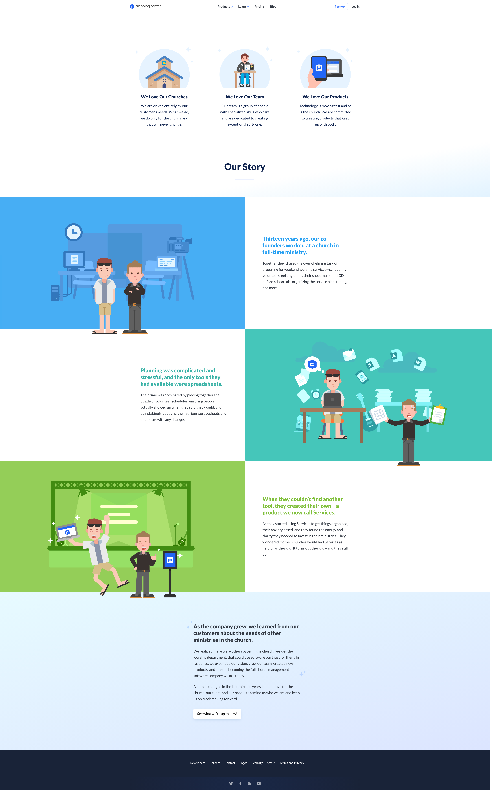

# The Project

Stories are what guide us. They help us learn from the mistakes and successes in the past. My favorite type of stories are origin stories. They can be some of the most enjoyable and exciting because you learn about where things come from or why things are the way they are now. Once you learn of the origin of something, you are less ignorant(harsh word I know) to any kind of current pattern.

Too deep? Ok well here it is in a more basic approach. Planning Center has a great origin and I wanted to try to capture that on our [about page](https://www.planningcenter.com/about) and really talk about the stories of both Jeff Berg and Aaron Stewart, and their start at Southwest Church in the palm desert.

I decided to take a little bit of an illustrative approach that fits Planning Center's asethetic.

### Scene 1 - Set the Stage

In this first image, we see our founders in their current enviroment which consists of audio gear, files, computers, etc. Basically all the things you need in order to run a worship service. You might not think that there is a lot that goes into Sunday morning church service, but let me tell you, after working for Planning Center for 8 years now, there is a ton.

### Scene 2 - Highlight the problems

Now we see that the characters are a little stressed out. The plot thickens you might say? Even though this is a very simple respresentation, the goal here is to visually tell a story and in that story there must be a moment that triggers some type of response. In the case with Planning Center, Jeff and Aaron had so much overhead when it came to planning worship services. There just was not a good process for doing it. So that lead to Jeff creating a solution that would not just solve the problems for his church, but for churches all over the world.

### Scene 3 - The Solution

It's time to showcase the solution. I was looking to create something with a little more energy here and that was achieved by adding some body movement to one of the characters. That coupled with positive facial expressions is something that I think visualy represents a positive change. And so it was, that Planning Center was born!

