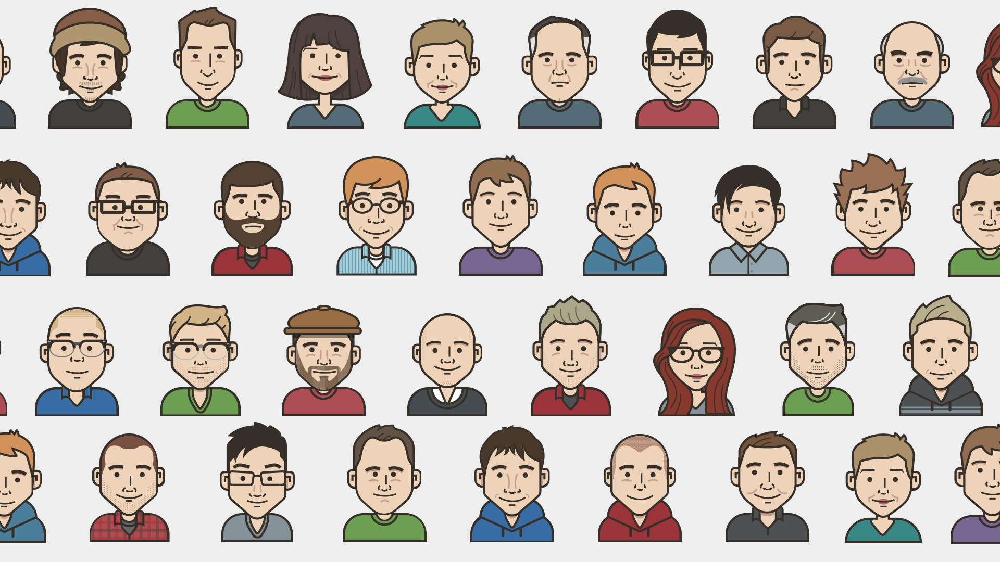

## The Origin
Slack has been a great tool for our companies communication both internal and external with our customers. Communication, I have found, is a vital attribute in any organization's structure. About 5 years ago, one of our developers (Kevin Thompson) suggested and idea for dashboards that would hung around the office - showing us important data like downtime, product use, and other fun features like what lunch would be that day.

While working on the ui for the dashboard, it was also suggested that we should have a section where we could see which developers were on call, and which support agents were answering phones. Then came the Avatars.

Since I had an illustrating background, I began to create the first set of Planning Center Avatars for our employees. I ended up making them for everyone because, why not right?

The first set where...ok. I look back at most things and realize how far I have come, and the avatars are definitely one of those things. With a team of 20ish people, designing avatars here and there were not a problem. But then something happened; we began to hire more.

## The Idea
With a team of more than 80 people, there starts to be the occasional request for an avatar update or change. Initially, I was willing to make the changes, but real work always took priority which led to my neglect of the teams avatar requests.

I didn't want to abandon the avatar idea but I just didn't have the time work on it. Thankfully, I work for an awesome company, and we have a thing called Free Weeks - Two weeks that we can dedicate to any idea that is for the company. Mine was an avatar generator for my co-workers.

I teamed up with Kevin Thompson and Jonathan Suh, and the three of us put together a really cool app called [Avatars](https://avatars.pco.bz) that connects right to your Slack account and allows you to make a custom avatar of yourself.

We've added some neat little features including the Ghostbusters jumpsuit and Marty's Life preserver. We plan on adding a lot more female heads and hairstyles. Right now it's a bit male centric so we want to add some diversity.

**TL;DR** [Here](https://avatars.pco.bz) is an avatar builder that can connect to your Slack account. You can login with your Slack info, and update your profile image right from the application.

_Credits_
 
**Front End:** Jonathan Suh
 
**Dev Magic:** Kevin Thompson
