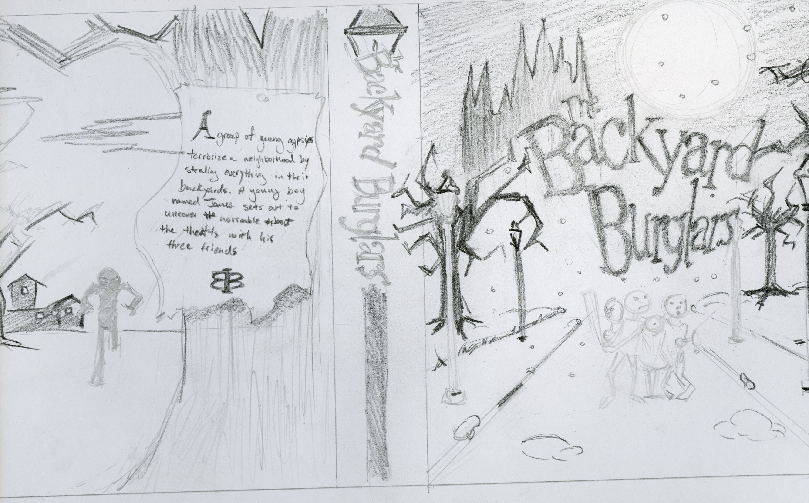
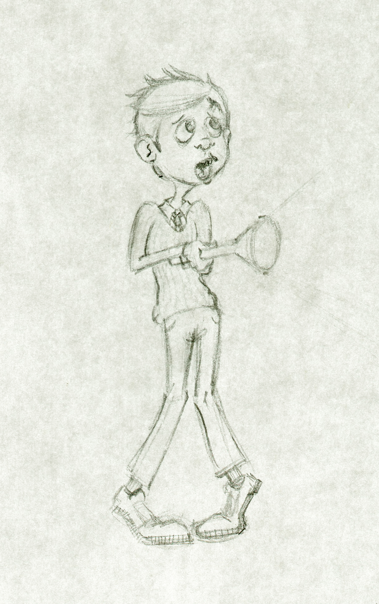
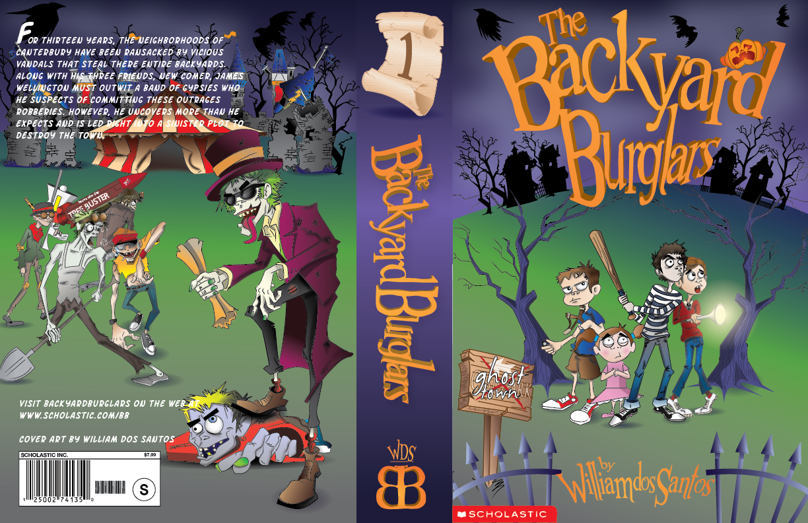

# The idea for the book

When I was fourteen, a man hopped over the fence and into our backyard. He hid in one of the fruit trees. The police chopper came flying over the house shinning a spot light into the yard, which is what alerted us to the occurance in the first place.

At the time, I had a comic book that I was developing for myself. The artwork was largely inspired from the Gorillaz and I just wanted to create something for myself.

## Draft 1 - 2008

The first attempt at writing a book was after I viisted my sister in Cantebury UK. I took the trip in 2008, and got to know a lot of different people. Some of the personas, I borrowed from the people that I met.

The idea was largely centered around a young boy that was placed into foster care and just arrived to a new town and was staying with a new family. After a series of strange robberies occur, the young boy James, and his new group of friends work together to find the culprits.

## The Cover Art

When I was in school at the Art Institute, I created an idea for what I thought at the time would be a good cover. The class was pretty cool even though I knew most of the ins and outs of Adobe Illustrator already. I already had worked for about 4 years on the characters looks at this point, so I had a vision for what it would look like. But I didn't really have a good story. First drafts are never really that great until you've gotten some honest feedback.

 
 

After a few character sketches I went to work in Illustrator. I didn't spend too much time on the outlines and would have liked to. There ultimately was a lot that I ended up not liking - especially with the legibility of the text on the back cover. But for the first run as a year 1 art student, I felt like it did the job.
 
 

## Update

As of now there is a website for [Backyard Burglars](http://backyardburglars.com) and the story is nearing the end of the editing process. I can honestly say, after years off and on with it, I'm ready for the next story. The artwork has taken more of an Edward Gorey turn and I'm feeling a lot better about it's progression.
