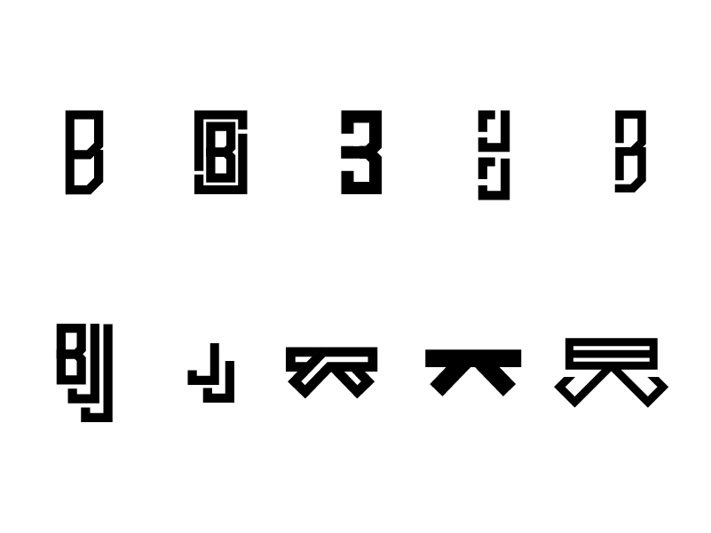
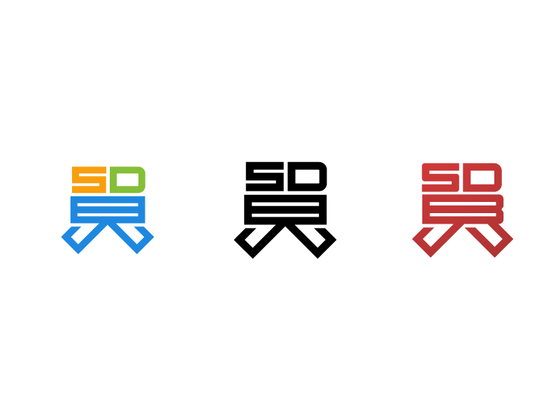
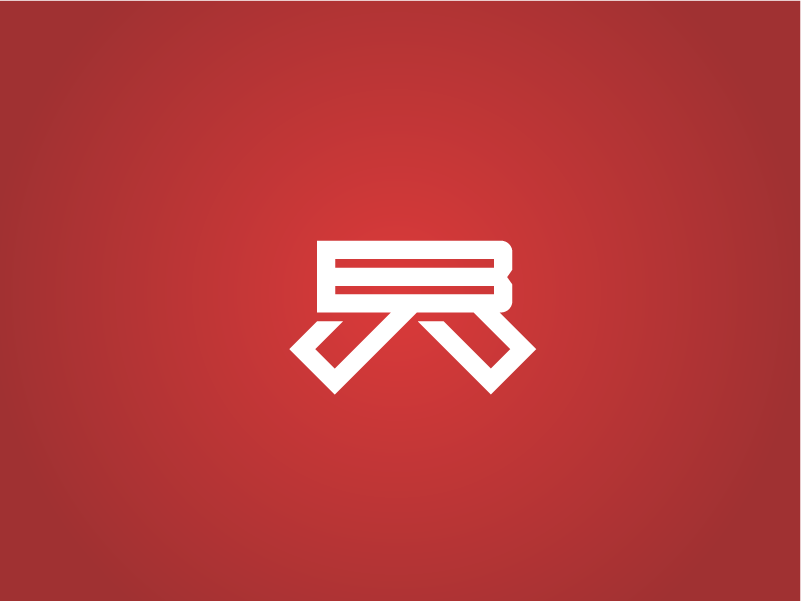

# The Branding of a Martial Art
I know. I know. Who do I think I am to take on the branding of a martial art. Well, simply put...nobody. I didn't do this to impress anyone in the BJJ community. I mainly did it for myself. I started playing BJJ about two years ago. At first, I hated the idea of rolling around on the ground with other people. I had done some "martial arts" in the past that included grappling, and basically I sucked at it. So, when I was looking for different martial arts to try, I wasn't to kneen on the idea of ground fighting.

Two years later, here I am. A proud student of [San Diego Brazilian Jiu Jitsu Academy](http://www.sdbjj.com) I have really learned a lot there. And the philosophy that Sensei Paulo Fernando has established at his school is, in my opinion, one of the best in the region. Not that I'm an expert.

Because I am a visual designer, I always look to see what the brand is that I support. Or, better put, a unifying symbol that connects all of the participants of that organization. The thing that says "We belong to this, and this to us."

So I started looking to see if there was something out there that was a visual symbol of Jiu Jistu. The best example of that that I found is that actual Japanese symbol of Jiu Jistu.

But still, that is not *Brazilian* Jiu Jistu. The Gracies have their own symbol for their schools, but that symbol is specific to the Gracie Academy and I don't want to steal anything from them. Not too mention, I don't belong to a Gracie Academy, so where to I belong?

I began with very basic ideas in illustrator.

## The Discovery
During the illustration process, I realized that there was a clear path with the visual of the belt look. From that point, I focused on bringing out the letters BJJ through the belt shape. For something like that, I always get a little nervous because there could be something out there that has already been done. But like the song says, *It's all been done.* Still, I spent a day looking around on the web, and didn't find anything. So I proceeded in the process.

## The Final
I finally came to, what I think, is a pretty cool logo treatment. There is still the look of of some sort of modern hiragana symbolism. The philiosphy of BJJ's belt system is very different than any other martial art in that it takes many many years to climb up the chain. So ultimately I feel like it was appropriate to include the belt form in the logo. I hope the BJJ community enjoys it. Who knows, maybe a Gracie will dig it as well.

