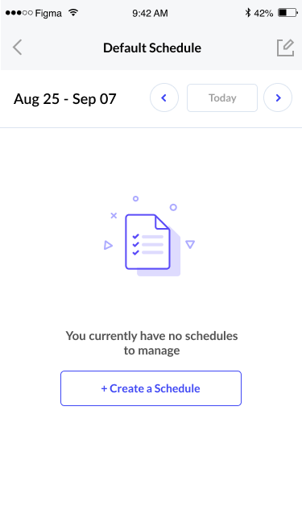
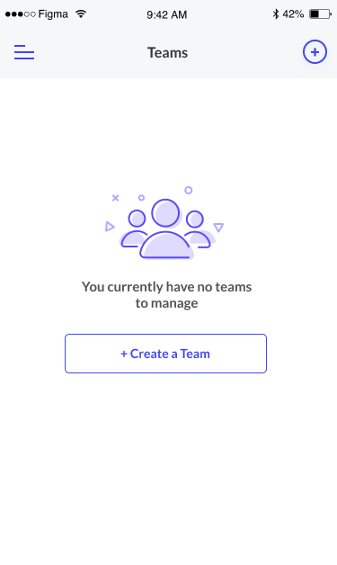

# Trying some new blank states

CSS-in-JS?! Ok by now we should all be aware of CSS-in-JS at this point but how many of us front-end design folks are actually implementing it that way? All of you?! Dang, I guess I'm super late to the party then. :)

 
 

