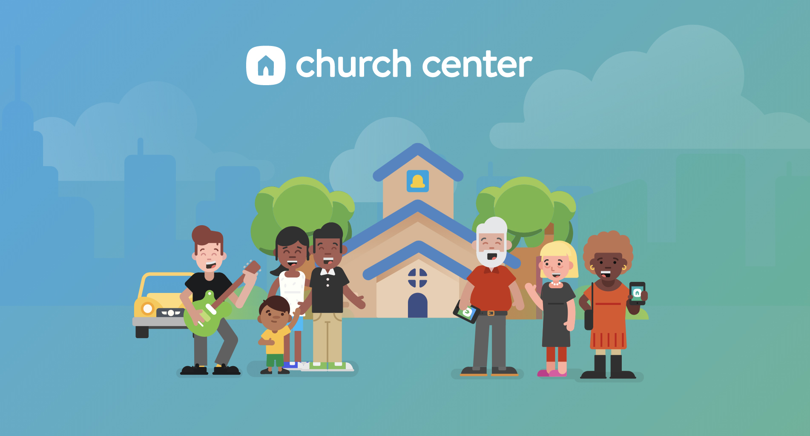
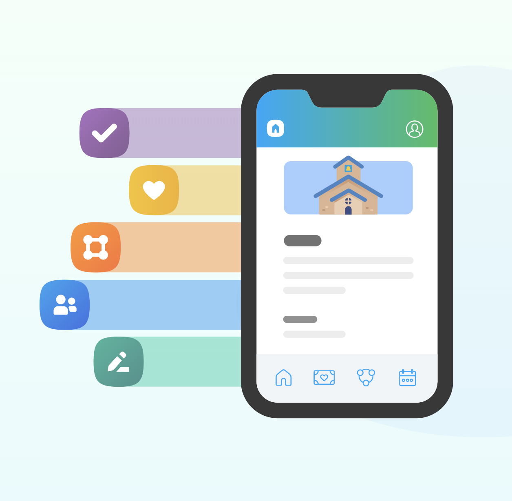
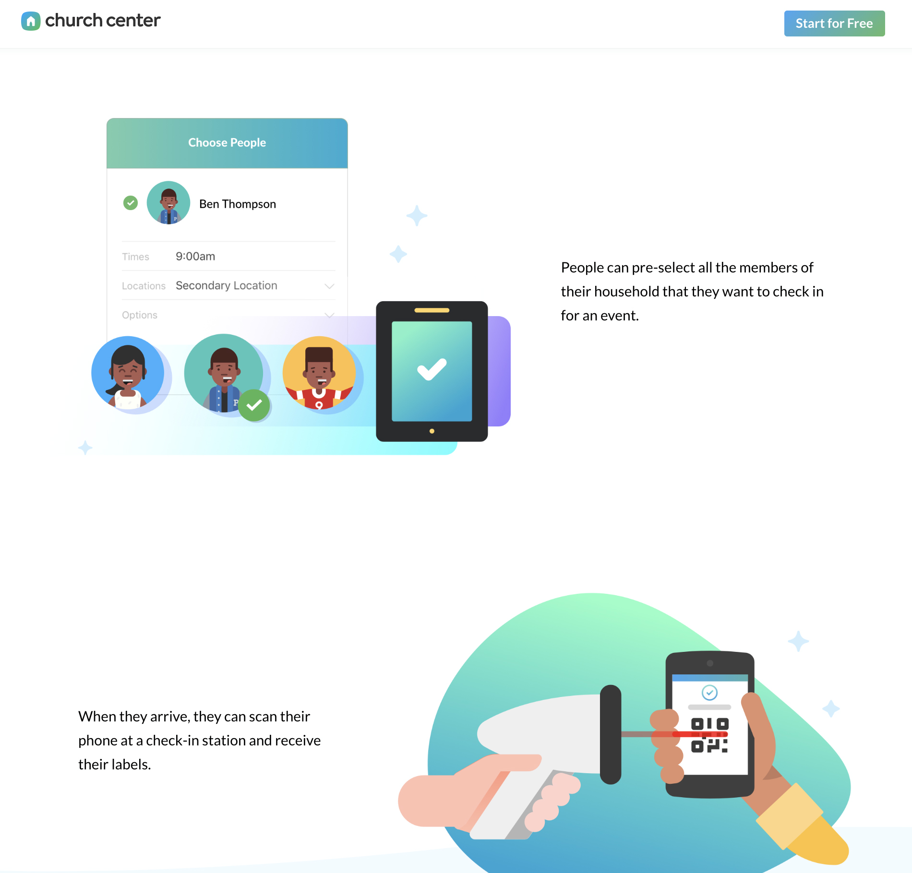
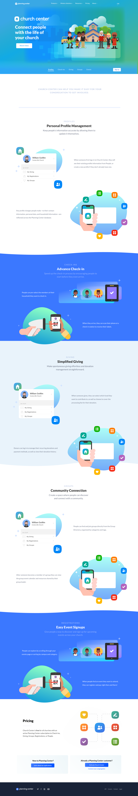
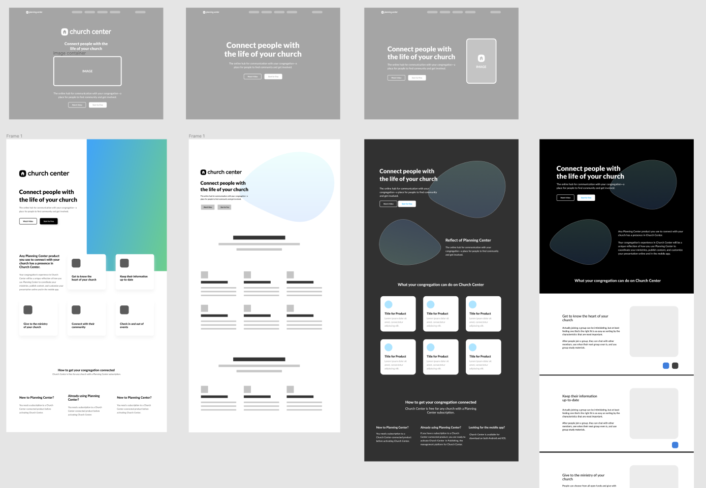
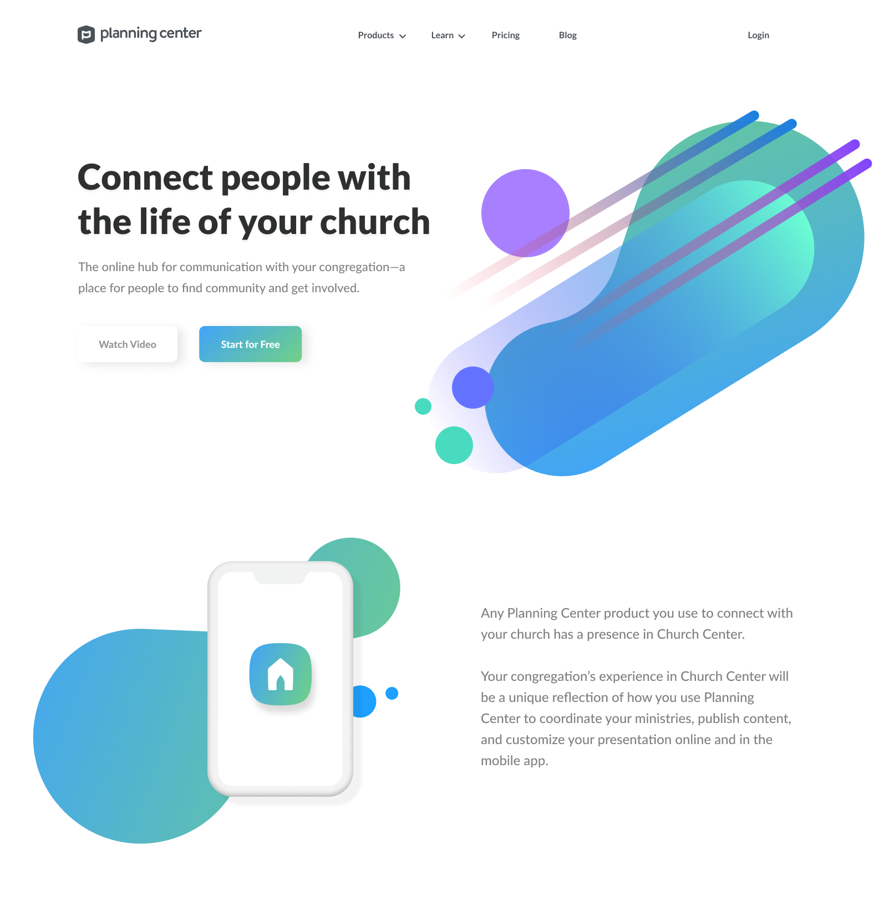
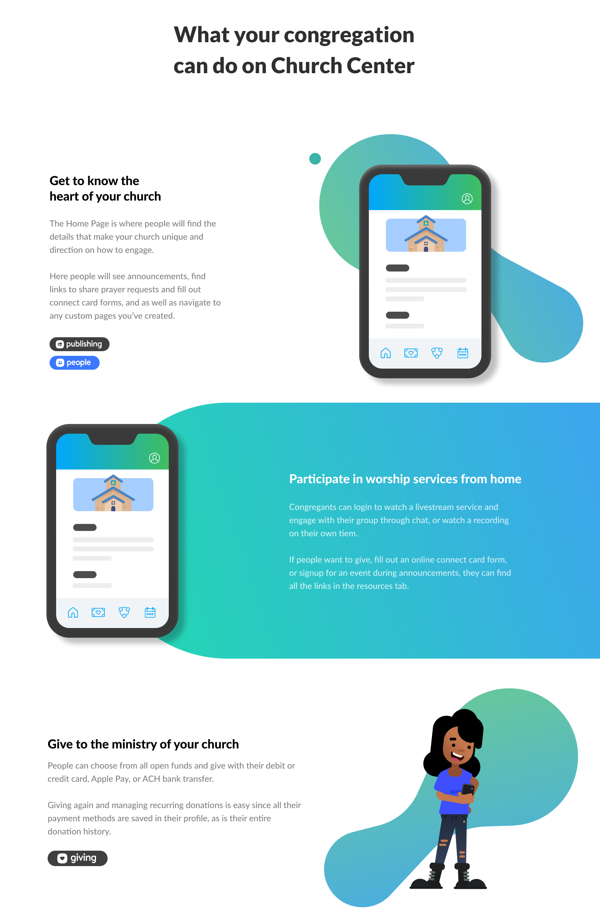
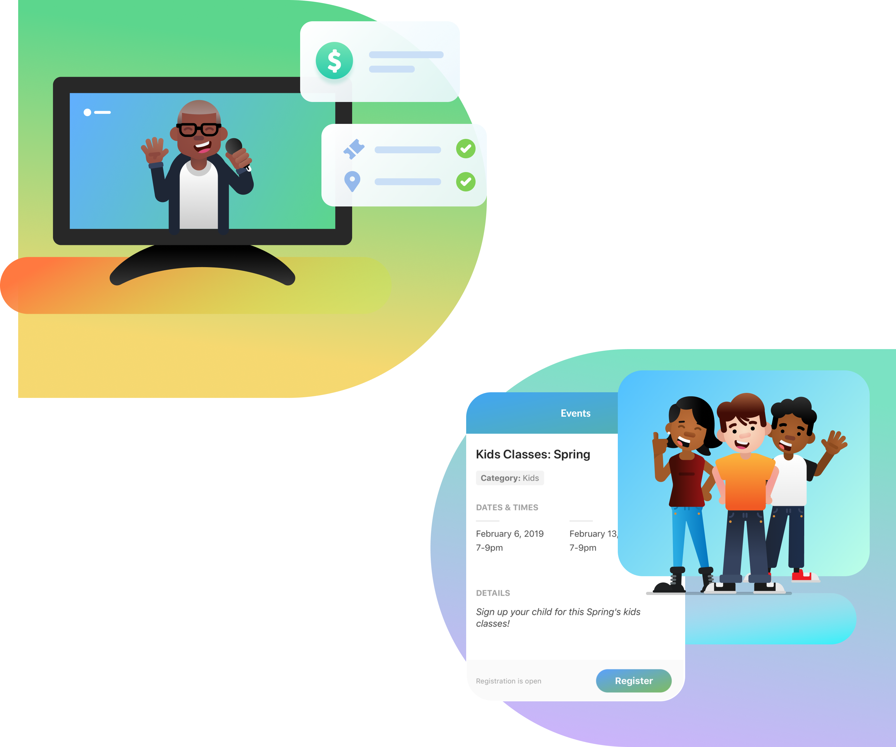

# Church Center

Churches are more than just building. They are people. Lots of people with lots of personalities, genders, ages....well you get the idea. That's why when the idea of creating a marketing page for such a diverse group of individuals came up, I was excited to be apart of it.

Church Center is an application that connects the congregants to the activities and events that are going on at their local church. Don't belong to one? No problem! With geolocating enabled, a person can view a list of churches (Churches that use Planning Center of course) that they might want to attend.

## Version 1

For version 1 of the marketing page, I had a hand full of tasks that ranged from front end design and implementation to user experience testing. To be honest, it was a while ago and I can't quite remember all of the specifics. Primarily, I stuck with the illustrations and web page layout for this round.

It was great to have gotten to work on the Church Center application as well. Having some knowledge there really helped me with fine tuning what the presentation should be for the marketing site.

#### Version 1.0 Illustrations

 
 

 
 

#### Version 1.0 Layout

_Quick note on layout: Areas where there are blank squares was reserved for actual pieces of UI._
 

 

## Version 2.0 - Marketing page revamp

### 1 year later

After about a year or so (possibly sooner) we had gathered enough customer engagement to warrant a redesign of the marketing page. Working together with our marketing coordinator (Emily Jiles) we were able to come up with a more updated marketing layout that would better suite the needs of the customers.

Some of the goals included:

1. Distinguishing Church Center from the rest of the Planning Center products as a stand alone app for congregants
2. Establish a connection between the admin side of Planning Center apps to the public facing side with Church Center
3. Point out the free cost to Church Center with the sign up of any Planning Center apps (Including the free ones)
4. Showcase more of the UI with individual features that would pertain to each application that Planning Center offers

#### Initial Comps

### Update the style

For this redesign, I wanted to try some of the trending styles I had seen with gradients being used by others I'd seen execute it. I really love the work of [Unfold](https://unfold.co/) particularly the work of [Eddie Lobanovskiy](https://dribbble.com/lobanovskiy) so you may notice similar style treatments in my attempts with Church Center.

I couldn't leave behind those fun little characters, so I gave them sort of a face lift as well with some nice gradients , less rigid body structure, and a little more culture diversity.

 
 

### Implementation

Implementation was fairly straight forward using our customized GatsbyJS site. We templated a lot of the pages out during earlier work. The biggest hurdle we faced was some of the illustration with the blobs or tubes that bled off to the left and right of the page. Accomplishing that for mobile and desktop views seemed a little more complex then it turned out to be.

Our team was really please with the new updates we took to make this page possible. Big thanks goes to our copywriter and marketing coordinator Emily Jiles and our Design Manager Shane Armitage.
