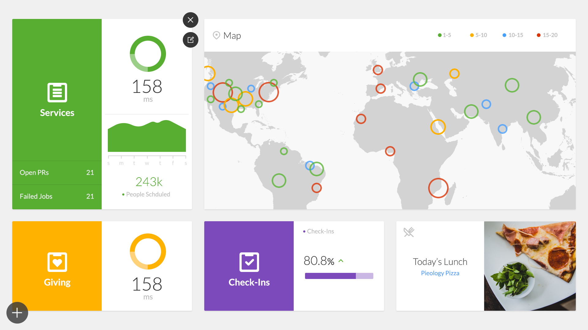
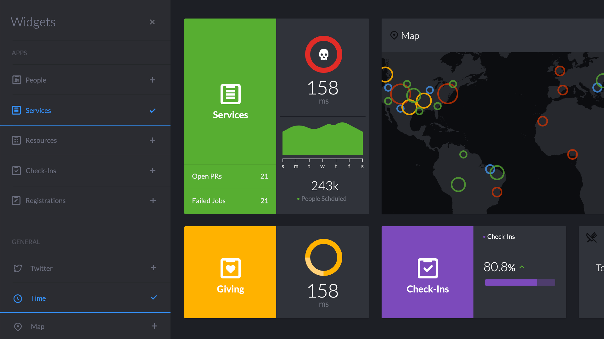
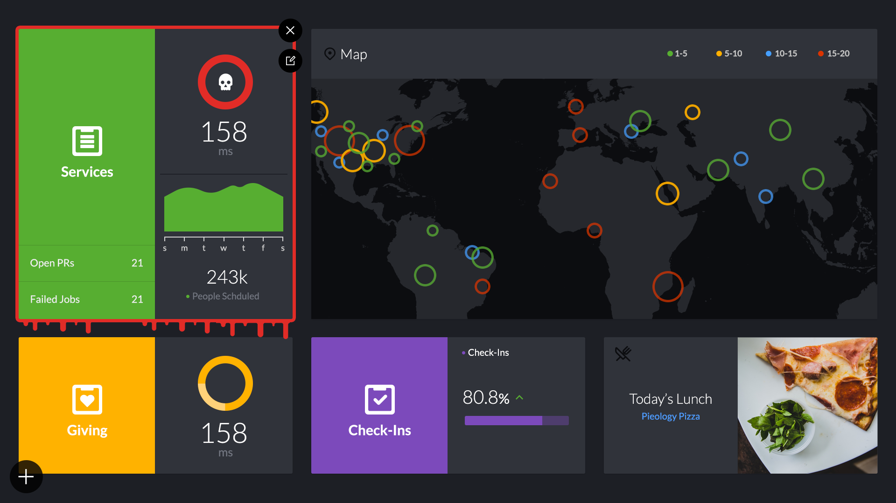

# The Idea

It's free week again! This time we are revamping an idea that my buddy and co-worker, Kevin Thompson, came up with a few years back to have dashboards around the office.

The dashboards themselves would be an internal tool for Planning Center to help us see any potential issues with our servers, amount of users at a given time, music that was playing, and other product related metrics.

The first dashboard that was designed was centered a lot around the people that were assigned to solve potential bugs and issues. The metrics were good but they just lacked a bit of engagement and after a while the asethetic (more along the lines of skewmorphic) started to get old.

## The Update

A group of us which included Tanner Mares, Travis Arnold, & Kevin Thompson, worked on a new verison of the dashboard. I took point on the redesign with some help there from Travis, but he mostly focused on the heavy CSS/JS animations as he was working on a few projects at the time. Kevin provided some much need insight on Dashing and how to work with it. Tanner did most of the development. It was a really fun experience to work with all of them. And by the end, seeing the dashboards on TV's around the office was just a great sight to see.

## Light Mode

## Dark Mode

I went a little overboard on the alerts for data base emergencies.

