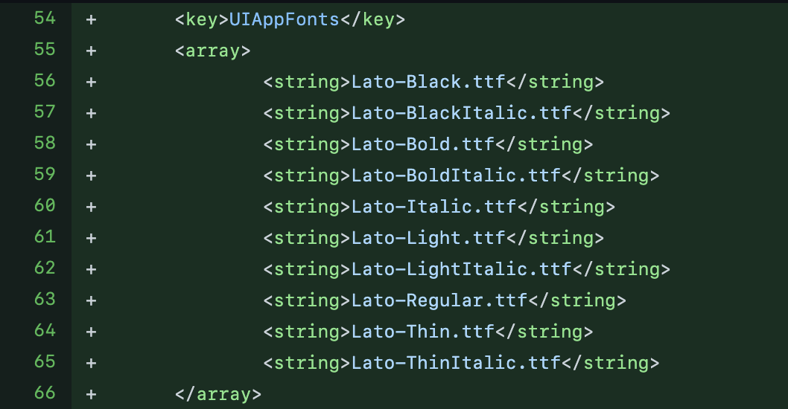
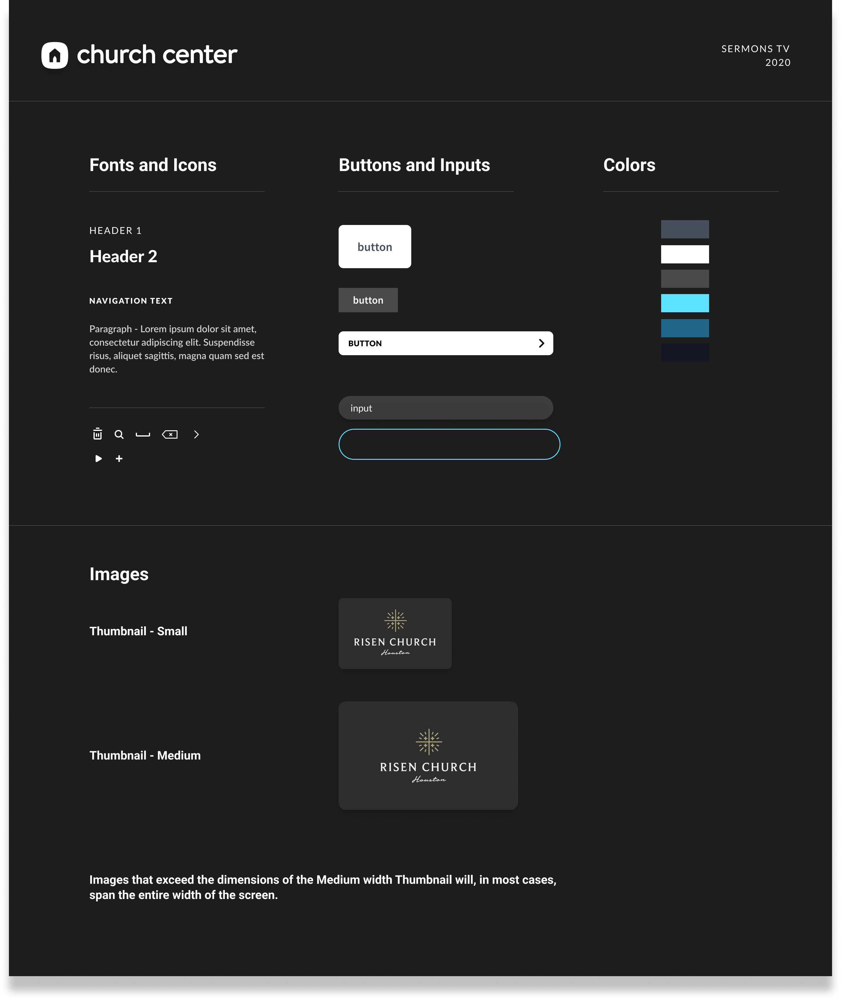
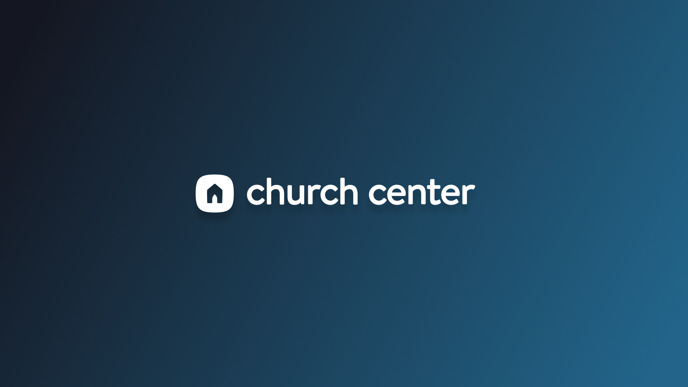
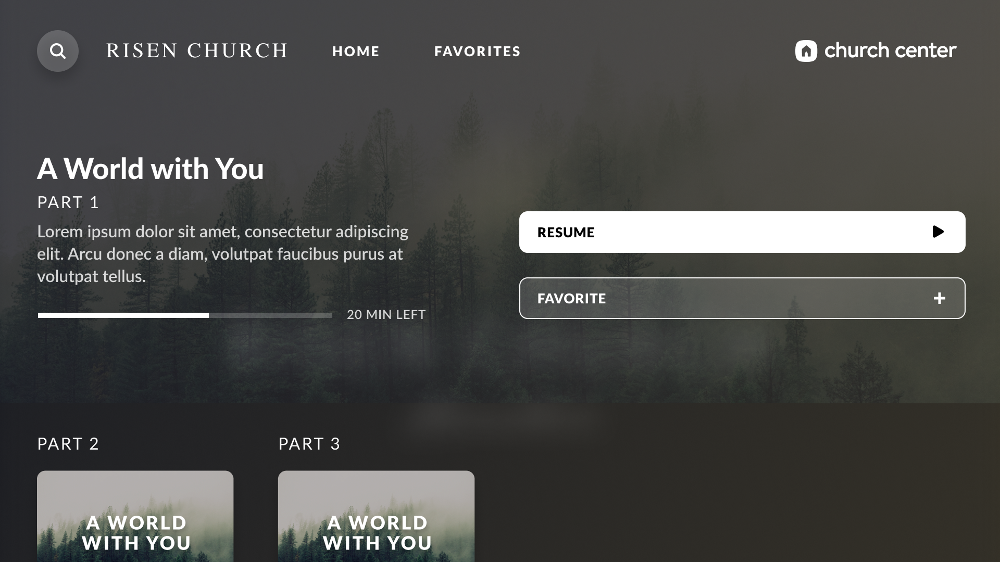
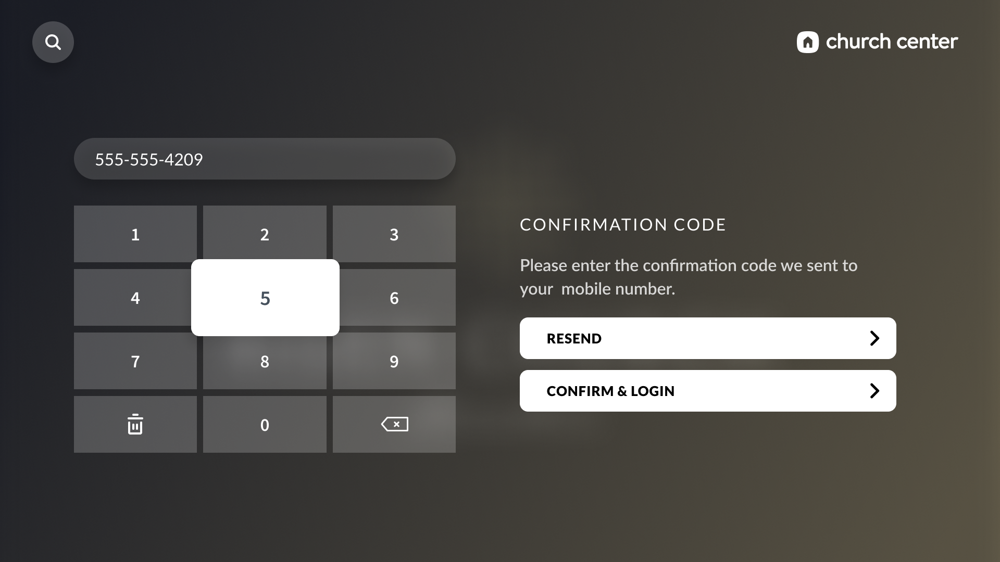
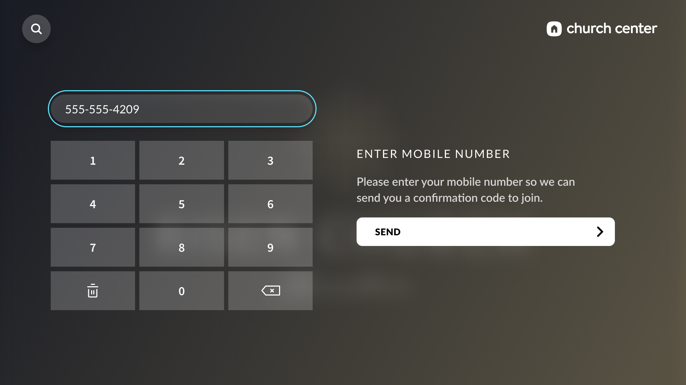
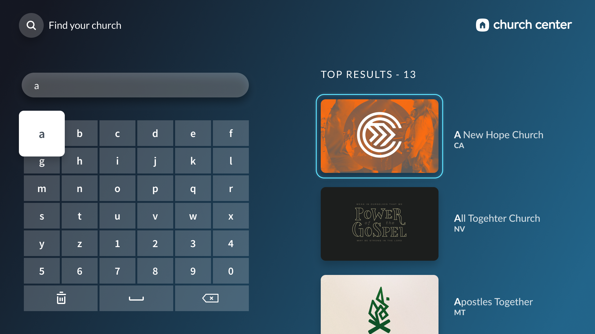
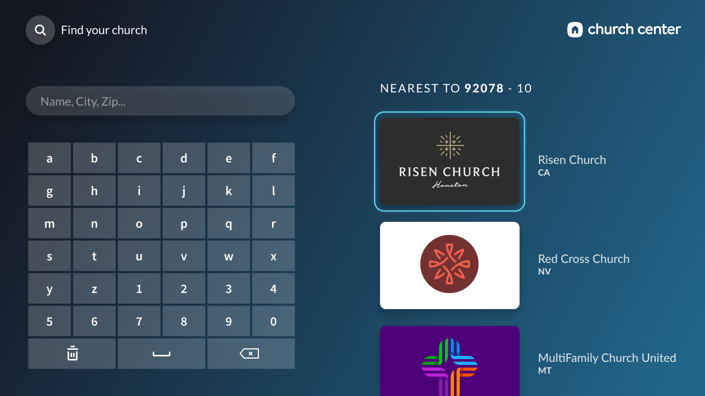
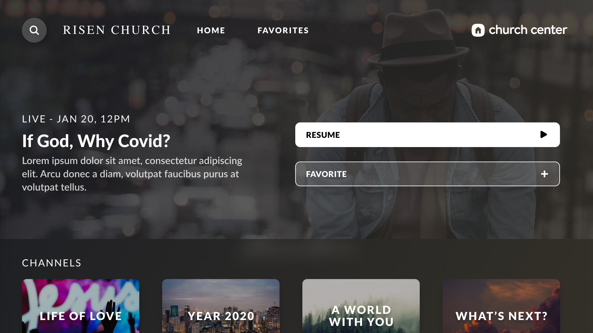
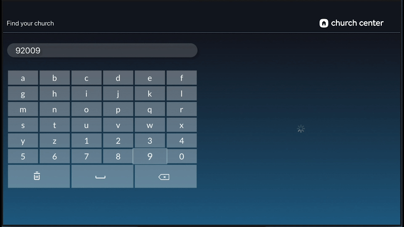

## Learning tvOS for Free Weeks

At Planning Center, we do this thing called Free Weeks (now Theme Weeks) where we take two weeks every quarter and work with a team on an idea, improvement, or new app in general. I've done a lot of different projects over the years for theme weeks but this one was one of the more knowledge gaining and challenging ones that I did.

I remember during an Event Apart Conference that I attended one year, and one of the speakers gave a talk on UI for TVs. He was very passionate about it and how designers needed to be learning and trying different patterns for television and that mobile was basically something of the past.

While I don't agree entirely with his assessment, I do believe that after doing this project with the team, I understand why he was so passionate.

TV is something that is a hallmark in any household across most of the western world and most of the world in general. People treat it as an appliance and typically, it's always on. Now with the age of streaming devices and platforms, there seems to be a heavy need for good quality design asethetic. It's not just the visuals with TV, it's also some phyiscal design with the sound as well.

When you move your selection now a section, the little _pop_ or _click_ makes the experience all the better. Really, there is just a lot of possibilities that we have yet to unlock.

### Custom fonts with tvOS

One of the biggest hurdles I faced was getting the Lato font working on tvOS. It's definitely not as simple as linking to the font path in your styles like on the web.

I found this guide for [adding custom fonts with ReactNative](https://mehrankhandev.medium.com/ultimate-guide-to-use-custom-fonts-in-react-native-77fcdf859cf4) , by Mehran Khan, extremely helpful. The only thing that really was tripping me up was the fact that there were two locations that I needed to change `Info.plist` If you have a testing environment, make sure that both `Info.plists` are updated.

Should look something like this:

### Styletyle Guide

Since this was my first style guide for tvOS, I just stuck with my standard approach as I would with either mobile or web and it for the most part paid off as far as presenting a visual representation to the team. However, when it came to development, that was a tricker part.

### Screens

I researched a few examples on dribbble and found some ideas that I thought could provide a good path forward when it came to the layout. Then I sat in front of my TV, and went through the different streaming apps that I subscribe to, taking pictures with my phone and writing down different things that I noticed. It was t was good information to use for the next few screens.

 
 

 
 

 
 

 
 

 
 

 
 

 
 

 
 

### Getting the basics working

Although we didn't get a final and shippable product in the two weeks we had, our team got pretty close which will provide a good path forward for creating a streaming app for churches everywhere.

## The Team

Loved working with all these guys and I can't wait to work with them more in the future.

- Brian Weaver, Team Lead
- Christopher Moel, Developer
- Erik Pedersen, Android Developer
- Geoffrey Lessel, Developer
- Greg Losie, Developer
- Peter Phillips, Developer
- Robbie Leib, Developer
- Me (WGDS), Design
