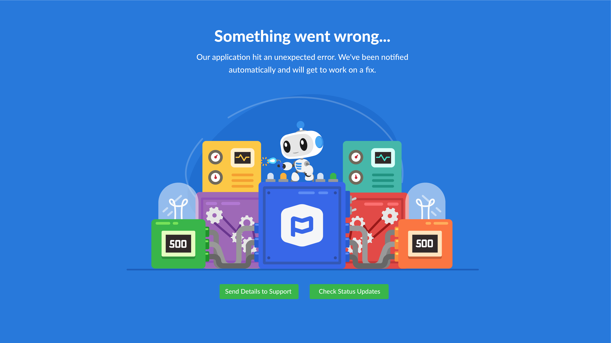
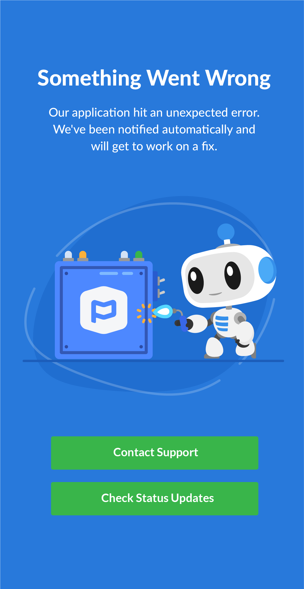

# Discovery

I wanted to take the error pages seriously. More than often I see web error pages that are boiler plate or just not taken to the level that they have the potential to be. With Lottie, there are a lot more possibilities now with vector illustrations to help keep people engaged and informed.

### Working with Lottie

Working with Lottie was really simple and seemless. If you have some basic After Effects knowledge, then setup should be pretty easy. One of the obviously gotchas is that Lottie animations are limited to shape objects only.

For example, if you try to do animations with adjustment layers or distortion effects, then the json file won't render correctly.

### The Design

For the Planning Center products, we typically have our mascot PiCO as a little helper for customers that run into issues or need help.

 
 

