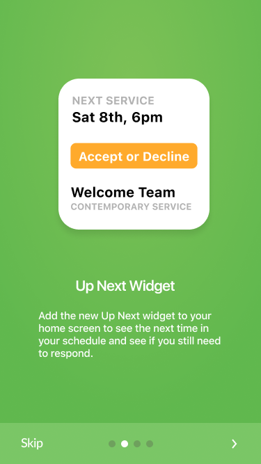
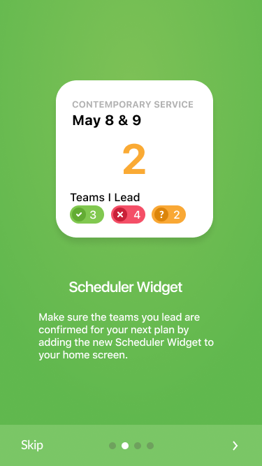
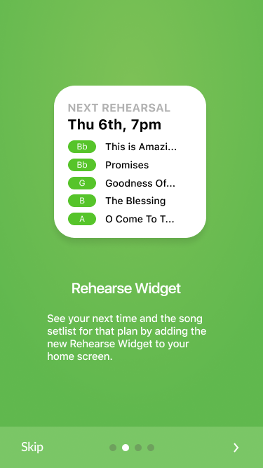
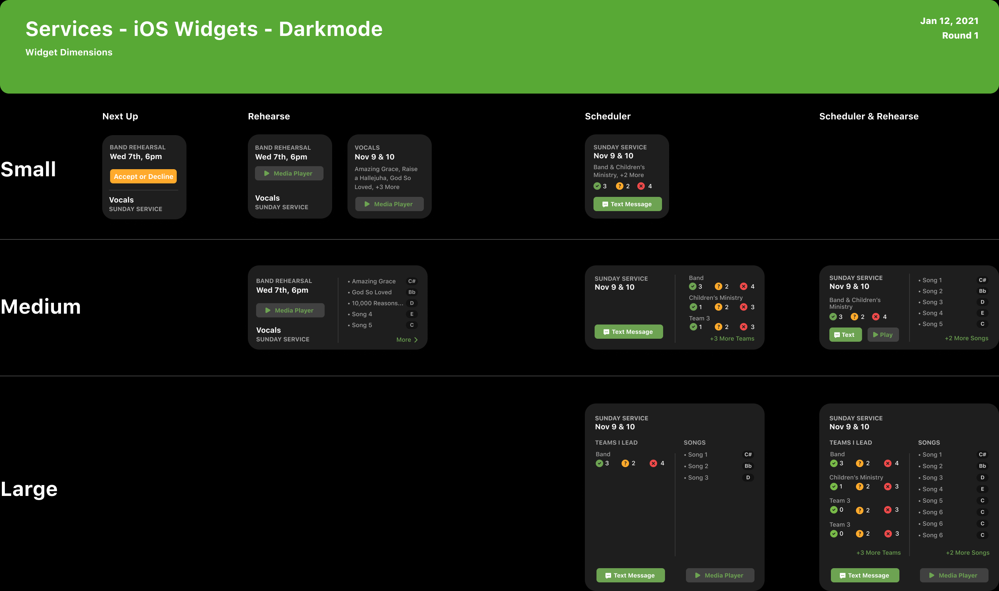
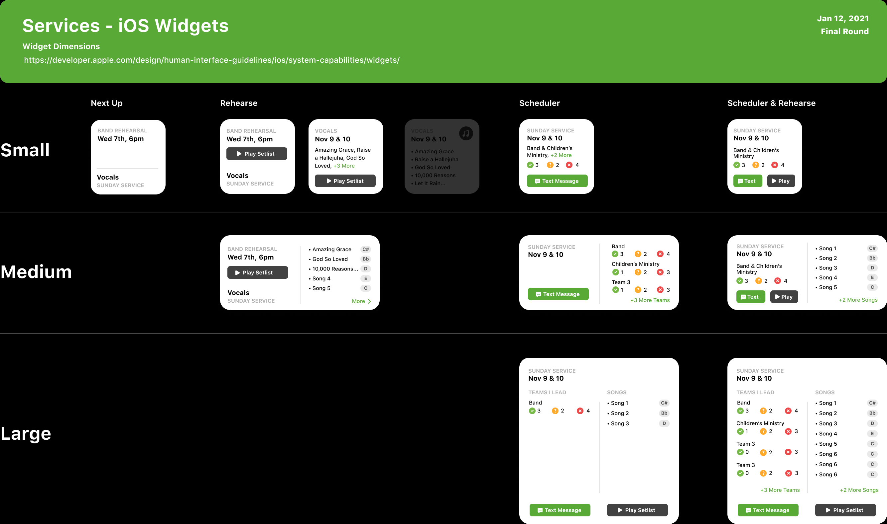

###It's pretty, but does it work?

What's the old saying? Function with form or form with function?

So you just wrapped up your latest Figma comps, pasted the link into your Slack channel, and now ready for the feedback. You're confident that this itiration is the one. It has to be! You did everything your manager requested of you, you listened and gathered customer feedback, looked a past examples, what UI was currently trending; you've done it all.

Notification goes off, and you are staring and that daunting compliment sandwich.

"It looks great! I love it! One small change..."

Oh man, delicious. I'm joking of course. Change is inevitable when it comes to design. And when you are designing for people of wonderous variety you have to take into account the different perspectives of experience in order to make the design have some function.

### A note on Accessibilty

This is something that I have igrnored in the past, and I regret it. Accessibility is not something that I have found very exciting to work on and I do feel icky saying that but it's the truth. I have always put it off to the last minute and didn't really think too much about it until I met a color blind friend of mine at Jiu Jitsu years ago.

He said to me "Hey, can you tell me which guys are wearing black belts and which are wearing blue? I can't tell the difference."

I was kind of shocked because of my own ignorance to something like that. I mean, this friend of mine, through no fault of his own, could have been trying to spare a little harder with a black belt or what he thought was a black belt, and actually was sparing a blue belt that was at his level. To people outside of the world of BJJ, it probably doesn't seem like a big deal. But trust me, there are certain people you want to spare hard with and certain ones you don't. Context and surrounding is important in any kind of martial art, and if you are unaware of the boundaries or limits you could hurt yourself or someone else.

With that said, accessibility is something that I am still improving on and although extensive testing wasn't complete with iOS widget project, I still think there were some good foundational tasks that were achieved.

But let's get back to design.

## Design for wrist devices

Designing for the Apple Watch was a great experience. Especially because you need to account for small touch surface areas. Which in our case, we just defaulted to having the entire surface link to a organization plan in [Planning Center Services](https://planningcenter.com/services)

The primary green was the principle color used but in the first few attempts I tried to limit it as much as possible. Below are some images from the onboarding screens once people launch the app on their mobile device after the update takes place.

The main idea is to get the person to take one solid action while at the same time get a bit of context as to the event or service they are volunteering for.

 
 

### Multiple device sizing

Accounting for the multiple device sizing was something that our product manager, Aaron Stewart, had chatted with me about. He gave me different stats and metrics that would be included in the different sizes.

In this case, when I designed the first few rounds, they looked really pretty however, there was a lot of confusion on what the UI that was there was actually conveying. _It didn't really work._

So, I worked with our product manager on a video call and rearranged the UI in order to make it a lot more usable for our users. Our lead designer Shane Armitage gave it some polish before we called it done. Overall, there was a lot of trial and error but the end result and conclusion is that even if it looks good, that doesn't mean that it will make sense to our users or even used. It has to work.

 
 

