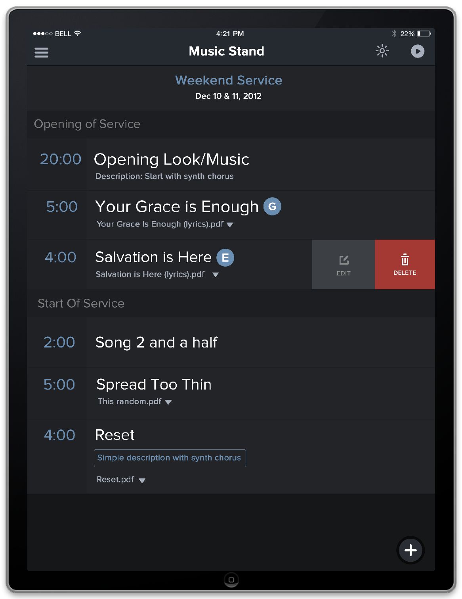
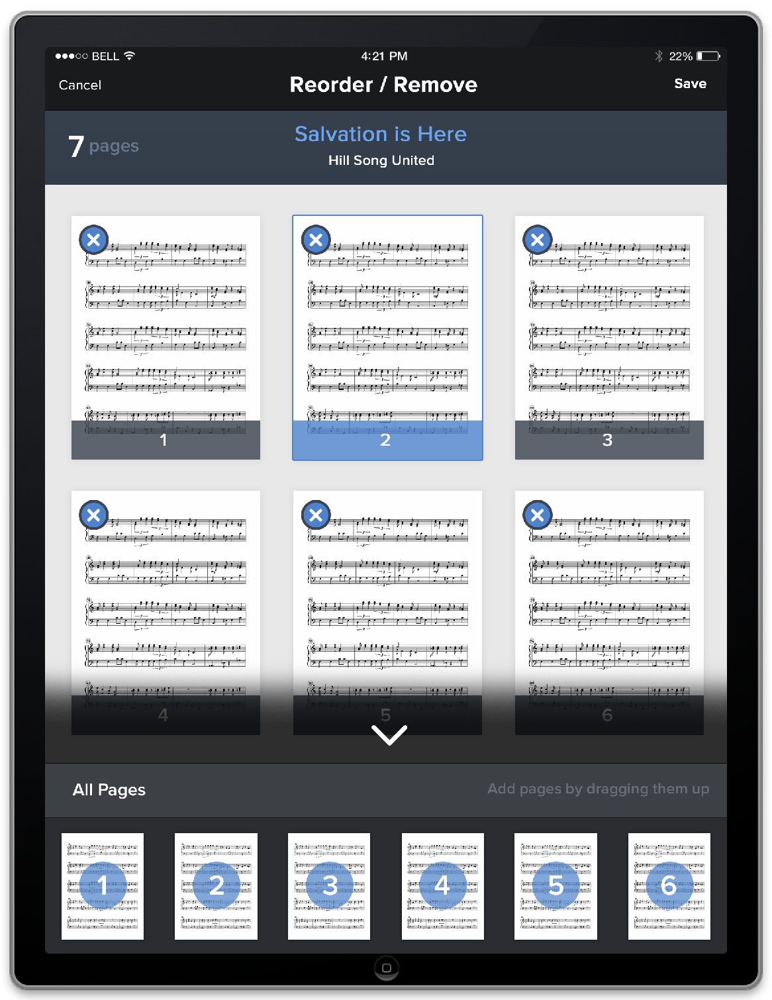
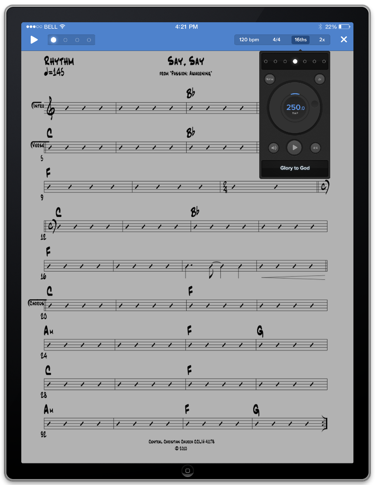
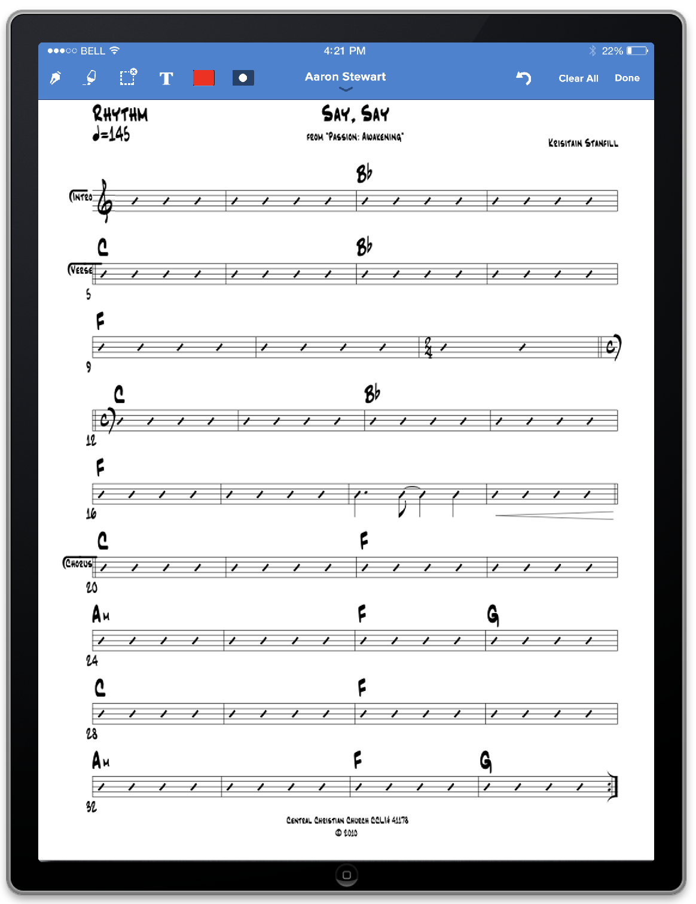
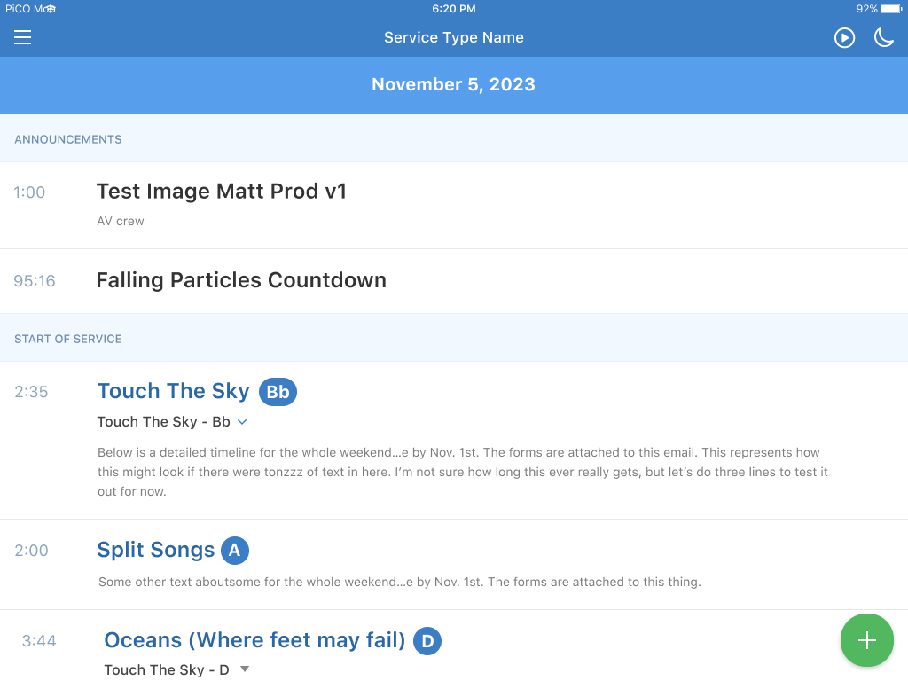
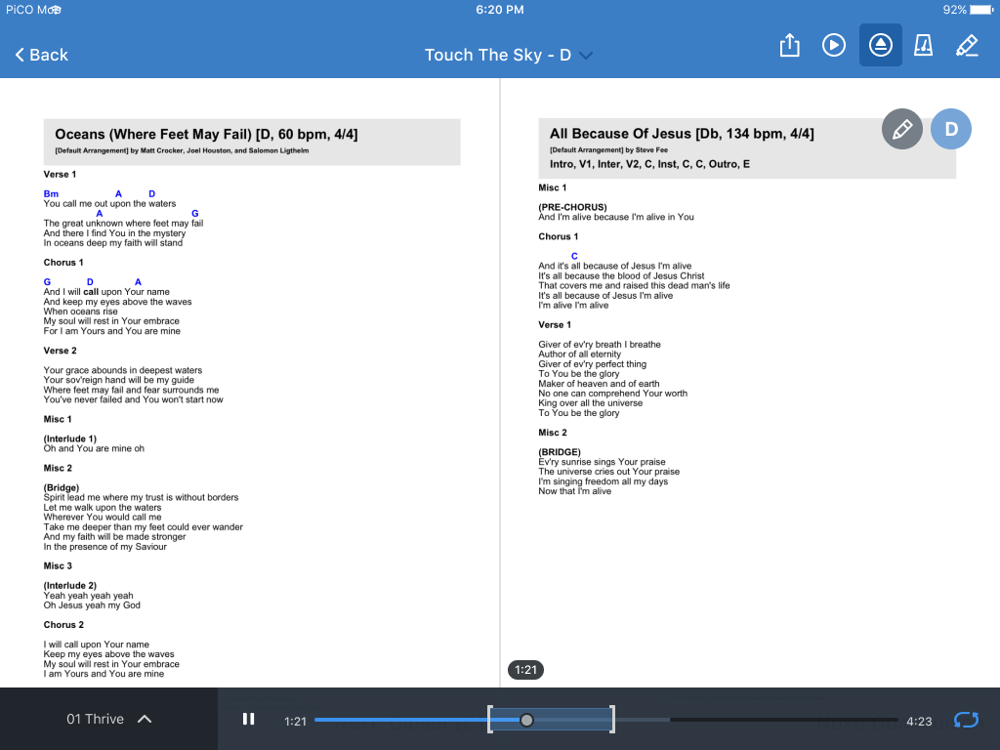
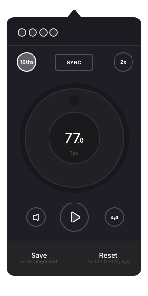
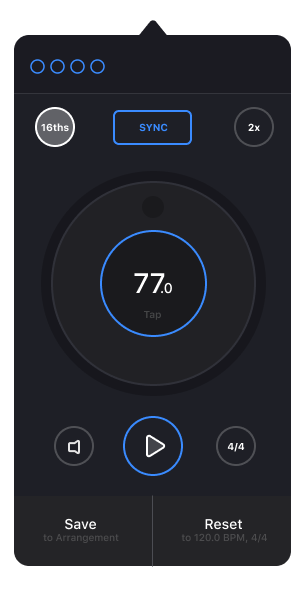

# Discovery

By the time I had joined Planning Center in 2011, the Music Stand application had been around just shy of a year. I was super intrigued by it because I was coming from a musical background. To me, having my sheet music digitally on an iPad to where I could make notes, rehearse, and organize made a ton of sense. Why didn't I think of this before? Probably because I had other priorities but none the less, the fine folks at Planning Center had created it.

The orginial conception of the made came out of the minds of Jeff Berg and Aaron Stewart. Later on, my friend and co-worker Peter Fokos took point on iOS development and our lead designer at the time, Shane Armitage, ran point on design.

I didn't join the project until about a year after it's first update and by then it was time for a little bit of an overhaul which was based on customer feedback.

In addition to updating the app asethically, some of the goals included:

1. Implementation of a metronome
2. Refined note taking and editing
3. Syncing displays
4. Audio player looping (just incase you need to rehearse a certain part of the song)

## Tools and Methods

With the wireframes there was a fair amount that was back and forth between myself and Aaron Stewart, who was Product Manager and Lead UX.

This project was done prior to Sketch and Figma, so I was still using Photoshop. Let the groans and eyerolls commence, I'm certain some people might have opinions there.

Anyone who remembers this little nudget of usefulness to slice up layers into individual pieces or icons: LayerCake/Slicy

I was leaning very skewmorphic those days (some of it has recently resurfaced in my work) but I really wanted to make it to where the UI felt similar to something one would physically use IRL. There was a fair amount of musicians at the time that seemed to be going more analog and less digital as well, so this path for the design seemed like a practical approach.

The latest update for Music Stand was accomplished with Adobe Illustrator. Again, this was prior to Sketch and Figma and we have been using those tools (primarily Figma) for the past few years now.

## Version 2.0

Version 2.0 was one of the earlier versions of Music Stand I reskinned and redesigned. There were a lot of improvements and to be honest it's a bit of a blur of what I can recall. One of the major additions was adding a dark mode to the app before dark mode was introduced as a standard for iOS.

We also updated the audio player and introduced a brand new feature: The metronome. I got a chance to work with some drummers on this and it was great to see them use the feature. At the time, flat design wasn't widely used and many apps were still using skewmorphic graphics. At the time, I was doing more flat design approach with a little real world shading and it seemed to be a nice in between at the time.

 
 

## More Updates

There were more updates down the line with a bit of a revision. I would really like to get back into redesigning the app and give it an even fresher look for this year or possibly next. Our lead designer, Shane Armitage, worked with me on some of these updates.

 
 

 
 

 
 

  
  

 
 

Music Stand is a great app and I think it's going to be one that we will see even more cool changes with in the future. If you ar interesting in getting a hands on look at the app, you can download it from the app store but the catch is that you need to have services account. If you can't do that or are not interested in that, you can check out our [marketing site](https://www.planningcenter.com/music-stand).
