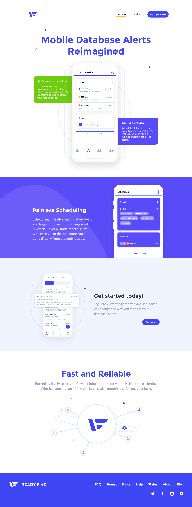
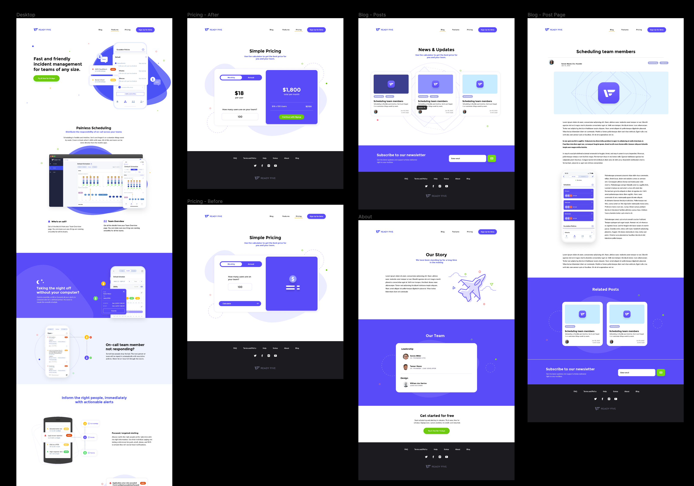

# Welcome to GatsbyJS

If you are hearing about GatsbyJS for the first time on my blog, first I am honored I get to share this with you. And second, perpare to have your mind blown. Well, maybe not but it's still pretty cool.

With GatsbyJS, you can make a lighting fast site with all the trimmings. The The GatsbyJS community is full of people that are contributing wonderful themes (gatsby starters) which make creating custom sites a lot easier for a front end developer.

In fact, this site was built using GatsbyJS and so is our marketing site at [Planning Center](https://www.planningcenter.com). So when our team at [ReadyFive](https://www.readyfive.io) wanted a marketing site, I knew exactly what I was going to use.

### Initial Comps

ReadyFive's founders James Miller and Tanner Mares, wanted something like looked clean and updated with a style that would blen nicely with the branding we did for the app. There wasn't a lot of thought when it came to the content at first, but after I started some low fidelity mockups, we were able to refine the approach.

This comp above was a first attempt at what the idea of the site could look like. Standard sections with some nice gradients in order to make the content stand out. The next section is more of an abstract approach but still with a similar layout and it was actually something that we did implement in the first round of coding up the site.

### Reflection and Revision

After fter sitting on it for a month or so, I took a brand new approach to the layout and simplified the design to strictly focus on the mobile app itself. The mobile app is what separates ReadyFive from both VictorOps(Splunk) and PagerDuty, in that we built it from the ground up just to include only the necessary features you would need for an alert system on your mobile device.

Howowever, this approach (while we did implement it) did not take off as a result of it being too similar to other sites that we have seen. Being inspired is one thing, but we don't want to come off as copying someone elses hard work. So we adjusted that layout and got to where we are today.

