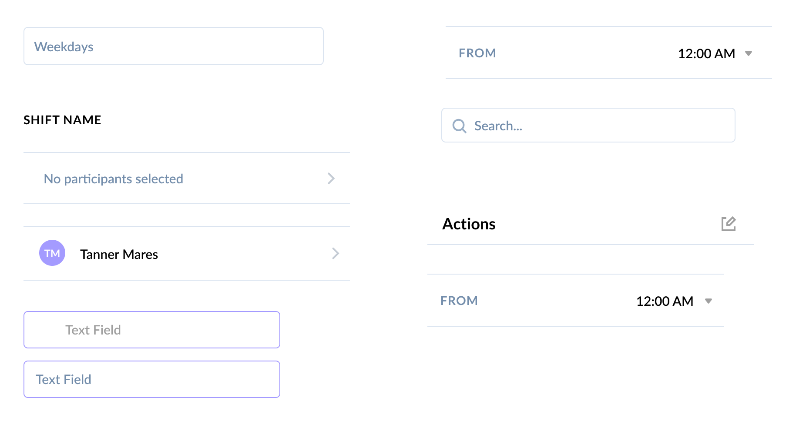
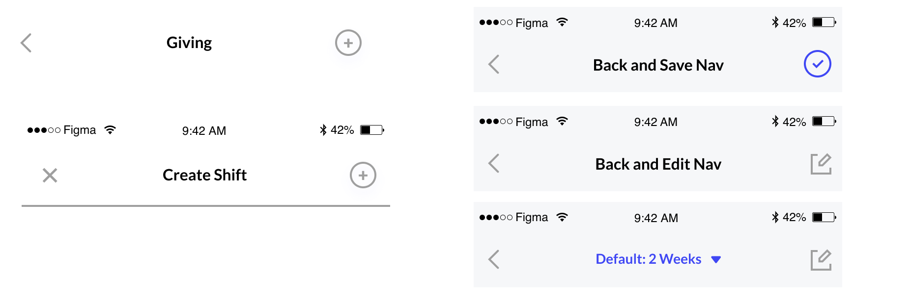
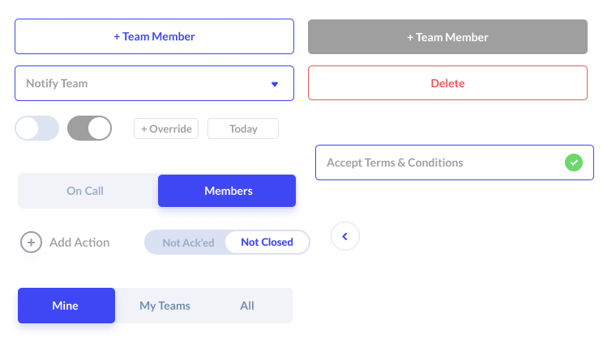
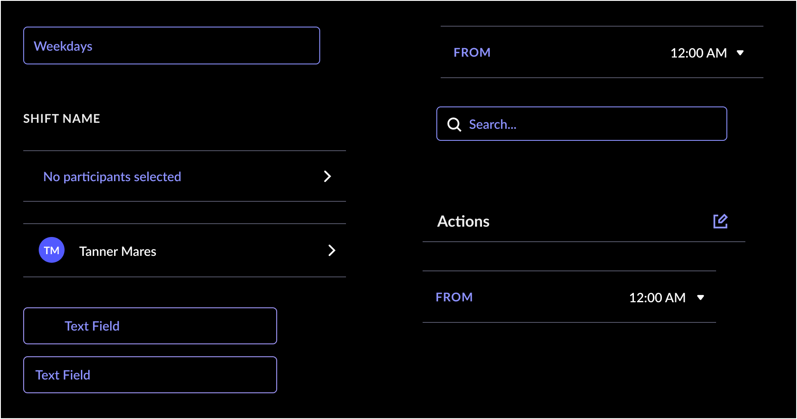
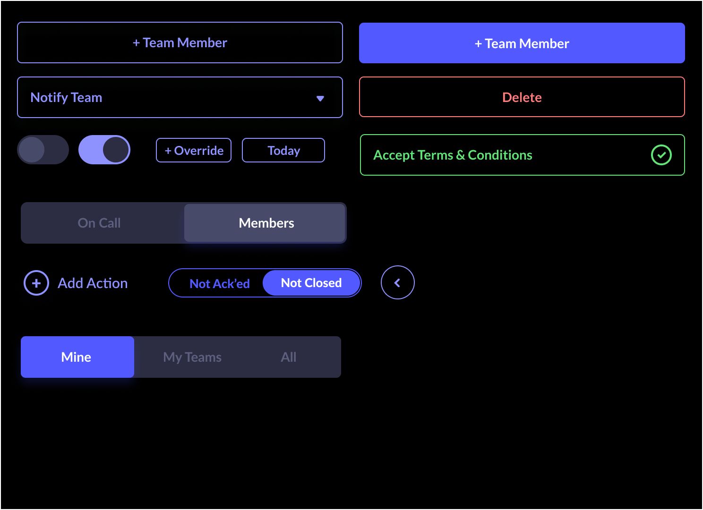
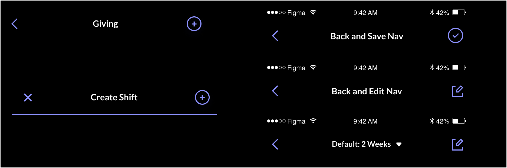
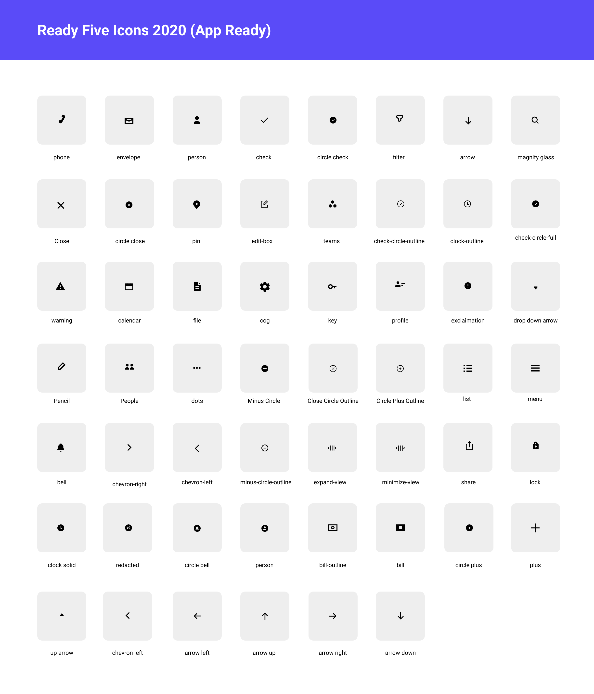

# Designing for React Native

CSS-in-JS?! Ok by now we should all be aware of CSS-in-JS at this point but how many of us front-end design folks are actually implementing it that way? All of you?! Dang, I guess I'm super late to the party then. :)

I'll be honest here, I'm not a guy that jumps on the latest and greatest right away. I like to relax and take my time to get to know something. To me it's like a tool that I really like to use. If I use it, it's because it works for me. However, I have also grown to appreciate trying new workflows, tools, and methods - CSS-in-JS being one of them.

Being that 80% of the people that I work with are developers, I get to experience a lot of new ideas and technologies. React Native is probably the latest and greatest that our team at Planning Center has been using for a few years now.

I finally got my crack at the implementation side of things when I started working with the ReadyFive team (James Miller and Tanner Mares), and let me tell you, there is some learning that will be involved.

So if you are a first timer with React Native and CSS-in-JS, I would recommend the following:

1. A basic understanding of CSS
2. A basic understanding of JS

That's it. The rest is kind of self explanitory with some gotchas along the way. The biggest hurdle for any front end developers is saying _className_ instead of _class_. There is also the requirement that within ever JS file (component) you have to keep your markup instead of one main _div_.

### Visual Design System

For the design system, I decided to work directly with our lead developer and co-founder Tanner Mares. The game plan was that I would define the styles in our Figma doc, and notify him once each section/category of the system was complete. Once he was notified, he would implement the styles. We hammered it out in about 2 weeks - if that. Love working with that guy!

Because I complete control of the visual direction and both James and Tanner trusted me to get the job done, I was was able to streamline the process a lot faster. There are a lot of things I would probably change, but in order to achieve a MVP, I felt it was necessary to move as fast as possible.

#### Light Mode

 
 

 
 

#### Dark Mode

Working on the dark mode, we decided to take an easier approach with only lessing the HSL by 20% for for the majority of the colors on the buttons and inputs. Thankfully, because the app is still fairly new, we have some room to experiment and gauge user feedback. One thing that is crucial and should have been from the beginning is accessibility, which we will be looking to refine further hopefully in the near future.

 
 

 
 

#### Icons

Making icons is always an enjoyable process for me. The image below is one of my earlier attempts and for the most part they all seemed to do the trick. Most developers I meet often default to package icons with Materials or any of the other hundreds of thousand icon packs that are out there, but I find that when I make them for a particular application or site, it gives it more identity.

