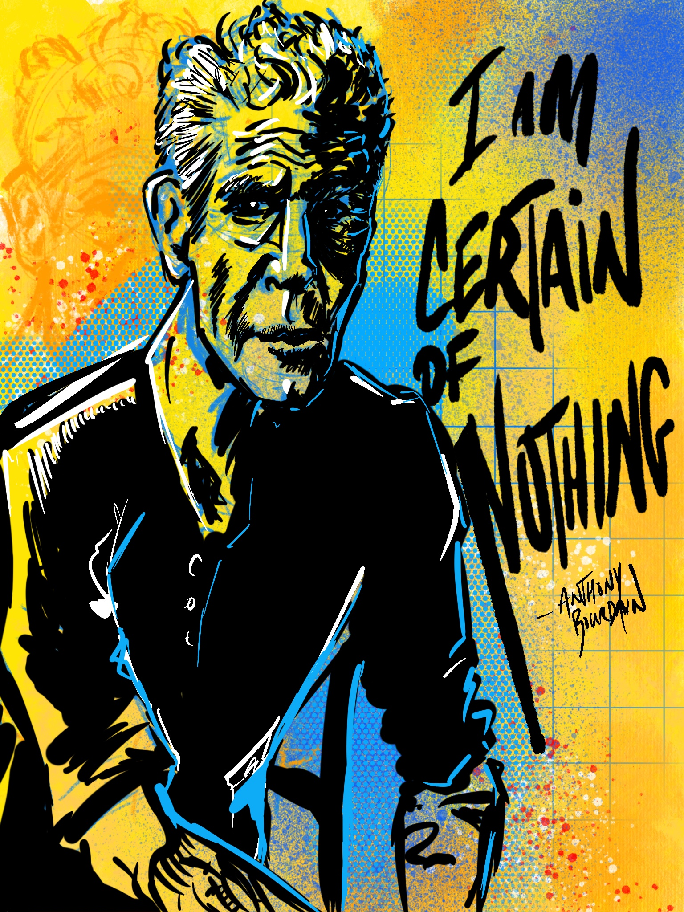

# Therapy and Drawing

Lockdowns, riots and protests, a deadly virus spreading around the globe. Yeah, you could say 2020 has been a little bit stressful. During that time, I took to turning my stress towards creative outlets wherever and whenever I could. Writing stories, working on side projects, and...drawing?

It's been years since I did any kind of portrait drawing or painting. I was sitting with my wife, Ashely, one day on the couch, and she asked me how I go about drawing a person.

I told her, that first I start with basic shapes that are close enough to the subject. So, circles, rectangles, triangles, etc. Just to get an outline of the figure or face.

Then, I start to make refinements on the little details. Add some places for the eyes and nose and then slowly it starts to come together.

It occurred to me, while I was drawing and explaining my process, that it was a good parallel and metaphor for life. It starts off very basic, then over time details and refinements are made. You might make mistakes along the way, but then you either draw over them or use your eraser to correct it. Before you know it, you have a complete picture.

I started drawing for about an hour a couple days a week, and would just knock out a portrait every day. I'm still a bit rusty compared to a lot of folks that I follow on Instagram, but I have come to define my style as somewhat of a messy explosion of feelings.

It's been a great therapy for me and I'm excited to continue it.

### Anthony Bourdain - I am certain of nothing

Someone that I found very impactful in my young adult life was and is Anthony Bourdain. I think that he had an amazing sense of the world and was a very geniune and honest individual. Even though I have differing beliefs and convictions than he did, I still think that he was a positive influence in the world and we can learn something from him. 'I am certain of nothing' is a tattoo that he has which he mentioned on one of the episodes of 'Parts Unknown'.

I think as I have gone through life, I have come to understand what the meaning of that tattoo is. Similar to the verse "The one that claims to know everything, really doesn't know much of anything at all."

I like to think that each day I will learn something and at the end of my life, have a collection to share with generations to come.

### Electric Haze - Jimi Hendrix

Someone that really influenced me in junior high school was Jimi Hendrix. In fact, I probably wouldn't be a designer if it weren't for his music. The energy that comes from those six strings of that left handed wonder is something that I feel is still impactful to this day.

### Kobe Bryant

My oldest nephew was and still is a huge fan of Kobe Bryant and sadly his death really impacted him. I think as a role model figure for many young people, Kobe set a great standard for athletisim and compassion with his charity work. I did this portrait as a gift to my nephew, Scott.

### Shadow Midas

This one was a fun one for my 8 year old nephew who is obessed with FortNite. Shadow Midas is his favorite character, so I decided to do a quick portrait of him for our game room. Can't wait for him to see it.
