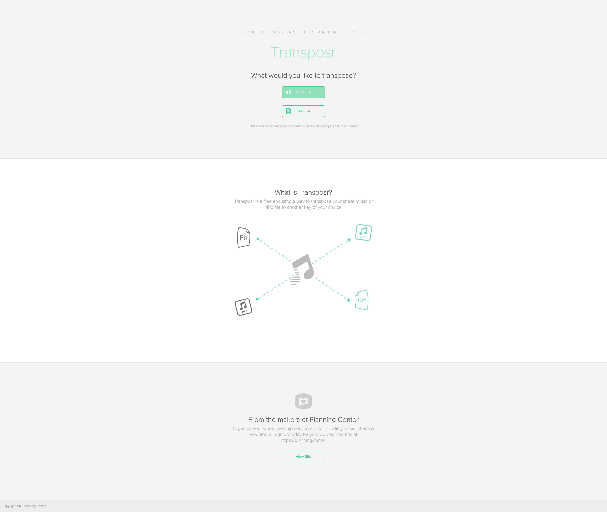

# Discovery

This was a project that was a revamp of the original app by Planning Center. Myself and one of our developers were tasked with redesigning and rearchitecting the application transposr.com

We ran into a slew of bugs while building ontop of the original, that we ended up deleting a lot of the old code. I can't speak much to the Ruby stuff, but all of the design and css was redone from mobile up :)

One thing to note, is that this is a free application. And we also have the ability to transpose music in our product Planning Center Services. However, in my mind, this product was what I like to call a "fish-hook app". Basically, a good way of marketing to people without actually marketing to them.

### Initial Layout & ReBranding

 
 

I kept the rebrand simple enough. Since I was the lead, everything, on the project, I got to make most of the judgement calls which was really fun. However, I do wish that our leadership cared a little more about the endevour. At the time, the Transposr site was still getting about 12k views per day. I saw an opportunity to really use the site as a platform to advertise our flagship app of Planning Center.

This was one of the last applications I designed in Photoshop before switching over to Sketch.

My idea was to sprinkle in some messaging that indicated that the user could accomplish the same goal of transposing music inside of our paid application, along with a ton of other cool features.

You can take a look at transposr.com [here](http://transposr.com), and try it out.
