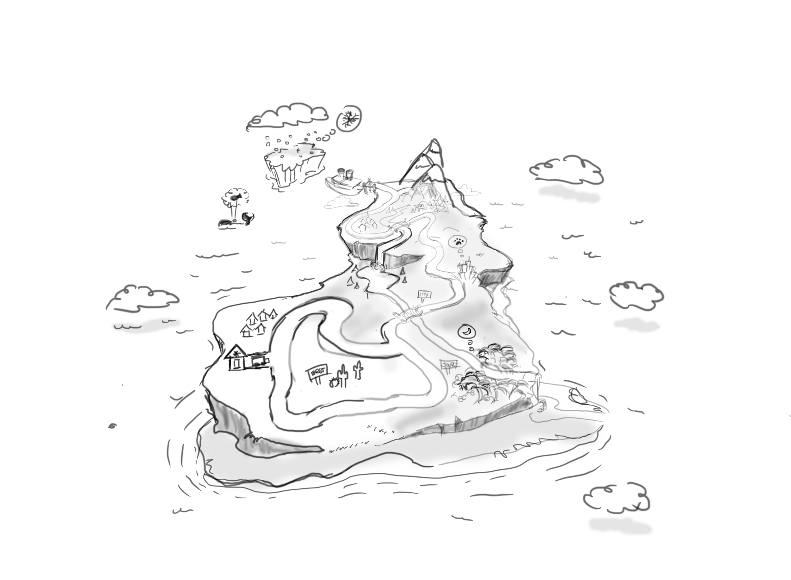
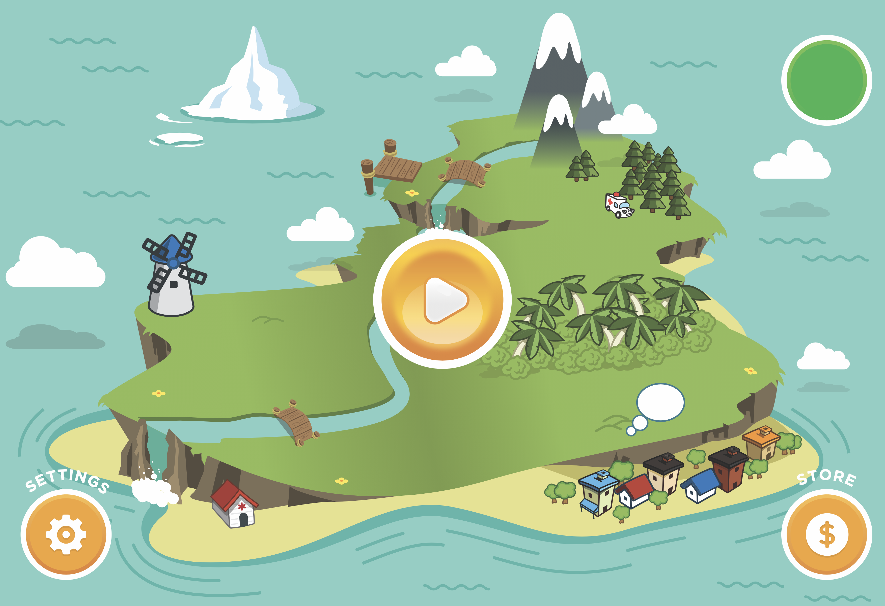
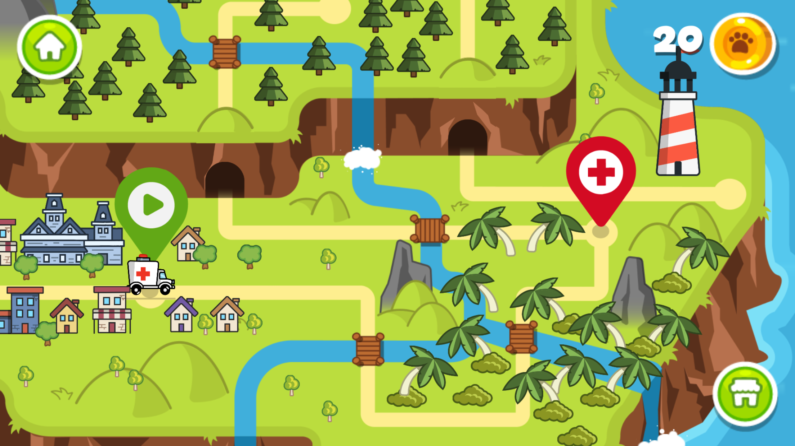
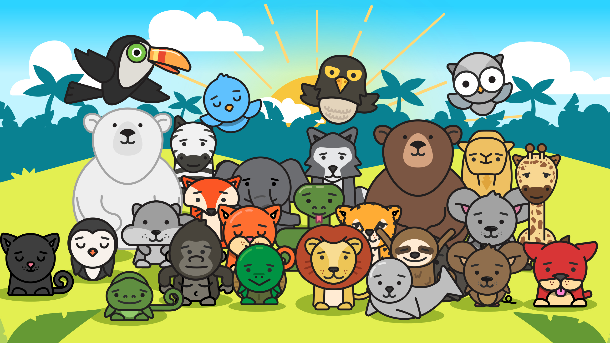
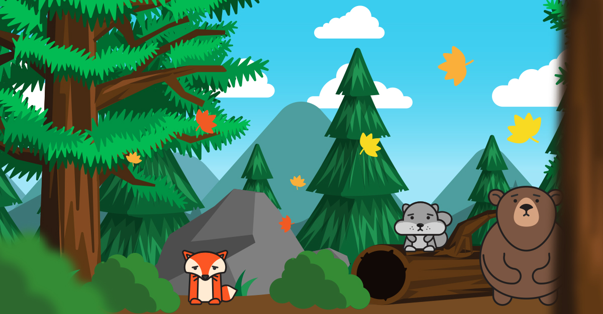
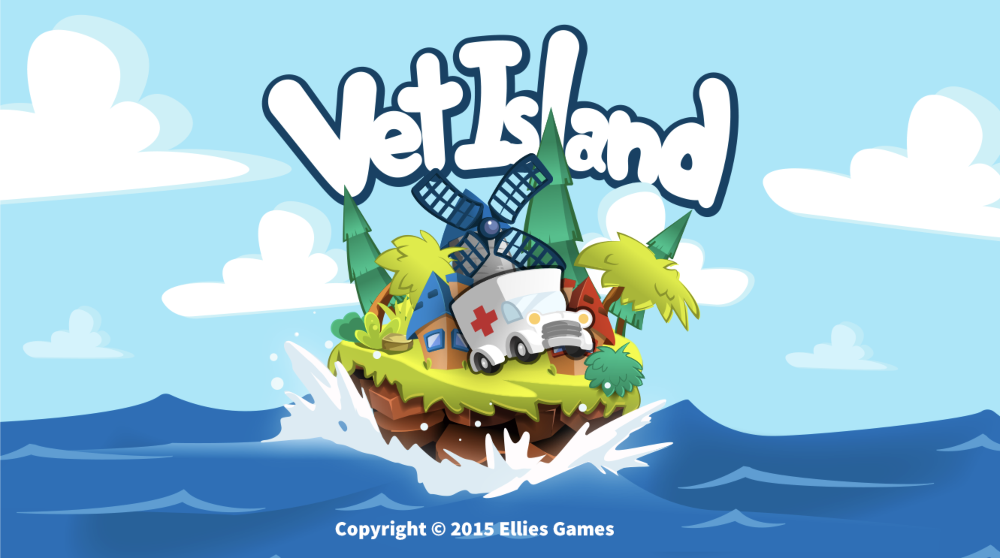

# Discovery

I was hot shit at the time...not really. It was 4 years into being employeed at Planning Center, and I was loving it. Learning everyday from a group of very talented people. The company had recently started recently holding tech talks and I took the opportunity to talk about Bridging the Knowledge Gap - a slightly modified and condensed talk that I stole from Jared Spool.

I put my own spin on with with some tricks that I heard from Sandy Metz, like the two beer test. The talk got me a little popular amongst the tech boys. During a game of giant jenga at one of the meet ups, I met a guy named Erik Bye. Dude was probably one of the friendliest guys I ever had the pleasure of meeting. I remember thinking, this guy can't be this happy. But it wasn't bullshit. He really was all around happy guy.

We began visiting and at one point he got my email and or number. A few weeks later, he hit me up asking if I wanted to work with him on a game. I was already in the middle of two other side projects, and I just couldn't take on another one in addition to my work. I told him sorry, but not this time. He understood and we said that we would reconnect on it at a later date. He stayed true to his word on that. A year later, he contacted me again.

We started to hang out, get lunch, talk about life and get to know one another. He had started his company, Ellies Games, a few years prior to meeting me. The whole idea behind it is that he wanted to make games from his daughter. He saw a void (at the time) in the market for mobile games for kids between the ages of 3-5. His daughter then was 6 so he was looking to create something that was a little more challenging for her. She had a recent love develop for animals and taking care of them, so he wanted to make a game based around that.

He had a couple of rough sketches for me to work off. I agreed to help and thought it would be fun to work on a game again.

## The Design

The initial design, looking back, was pretty rough. One day, I was watching my nephew Daniel play Super Mario Bros. on the NES, and I thought, that it would be pretty cool to mimic that style of game play navigation for the island. I mean it must be a good design for a 6 year old kid to still like it in 2015 right?

Who am I kidding, the Super Mario Bros. game for NES is legendary, and if you don't think so then get off my site now :)

## Character Design

After a few character sketches I went to work in Illustrator. I didn't spend too much time on the outlines and would have liked to. There ultimately was a lot that I ended up not liking - especially with the legibility of the text on the back cover. But for the first run as a year 1 art student, I felt like it did the job.
 
 

 
 

## Gameplay

If you want to try the game, you can download it from the Google Play Store and the App Store. You can also visit [Vet Island](http://vetisland.com) to get a little more of an overview of the game and our ideas behind it.

