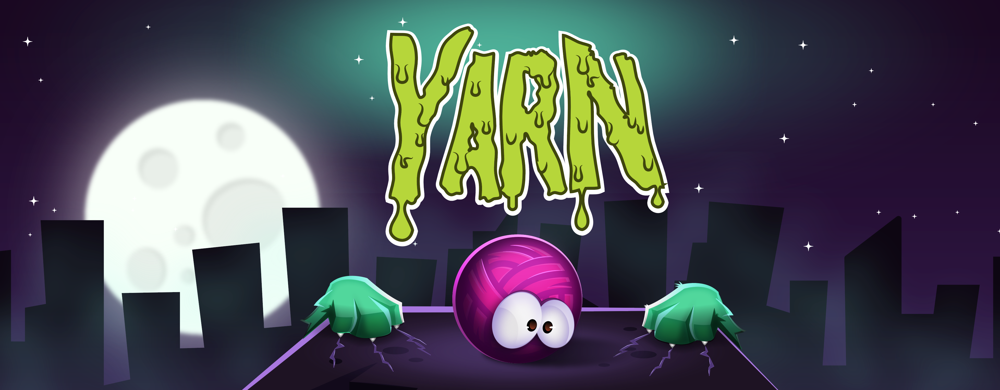
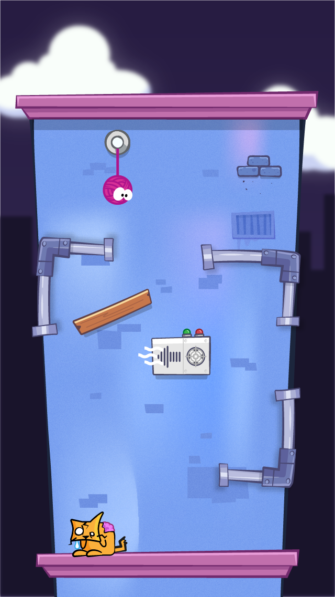
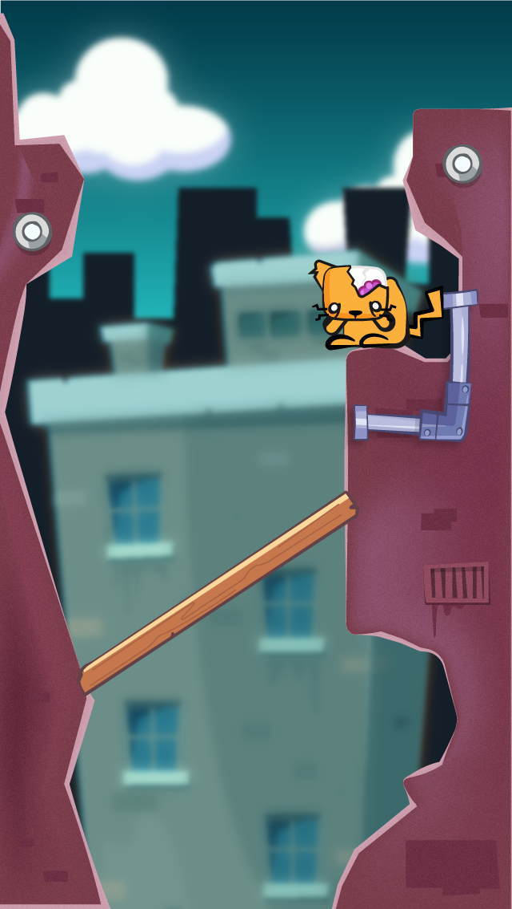
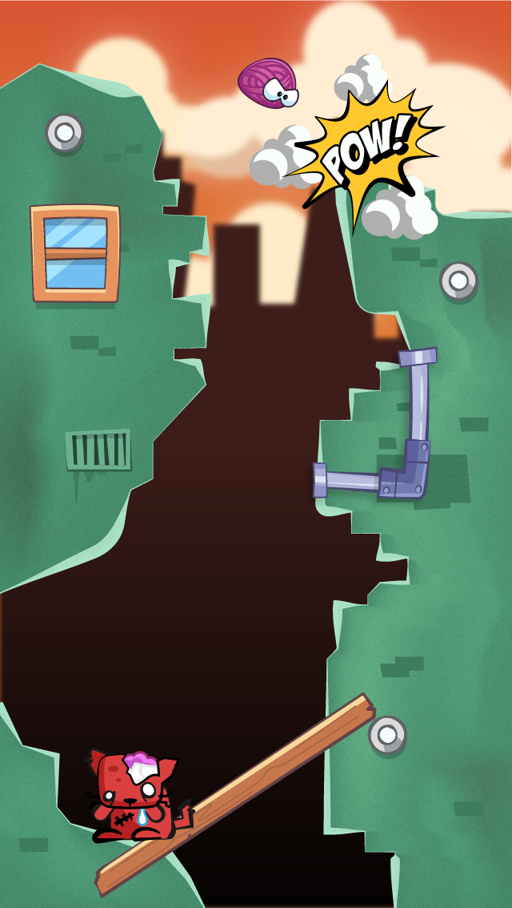
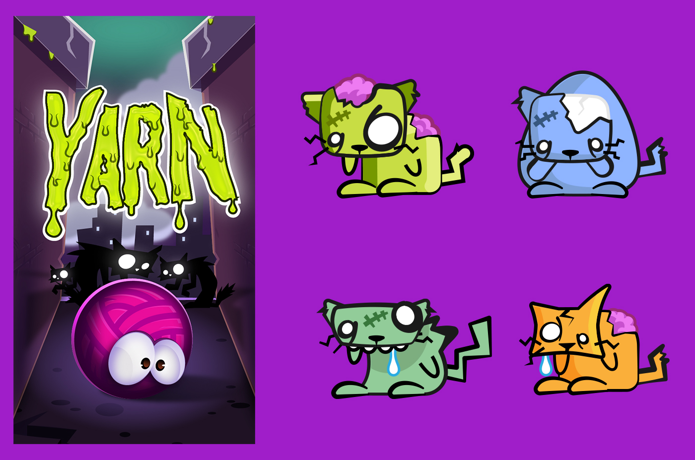
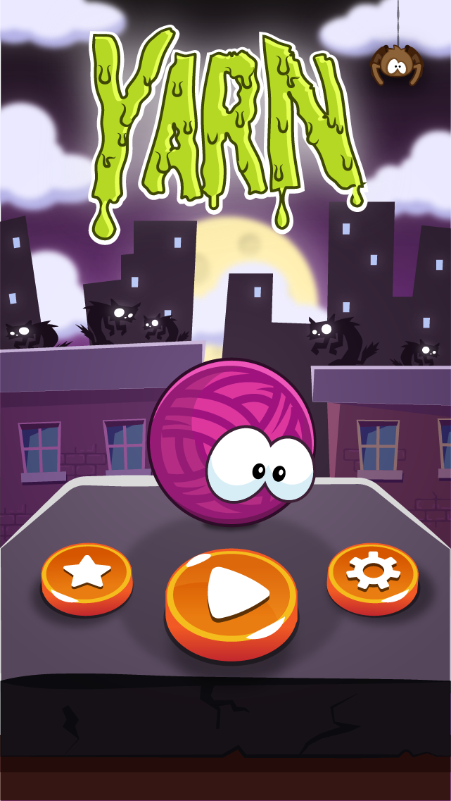

# The Game Idea

Ever wanted to build an mobile game? Well, I sure did. Thankfully, I met a really cool dude named [Erik Bye](https://twitter.com/madclouds?lang=en). He had been making games for his daughter Ellie for a number of years before we met under his own company [Ellies Games](http://elliesgames.com/).

After we built our first game together, [Vet Island](http://www.vetisland.com) we decided to keep going with an idea that a group of friends and myself came up with in college. The title of the game, Yarn.

After graduation and going off on our own career paths, I decided to reach out to everyone and see if they wanted to resurrect the idea. Everyone was busy on other projects but gave me the go ahead to run with it. At that point I had been doing work with Ellies Games for about a year and I decided to pitch the idea. After some back and forth, we came to what we thought was a pretty descent approach to the gameplay.

In my mind, I had this idea for a fun game with a "nickelodeon" slime feel mixed with some comic book action! So I completely rebranded and redesigned the game from it's original concept. Asethetically, it's something that I'm still super happy with with minor adjustments here and there that I still might make.

## Yarn - Puzzle & level design

The first idea was largely based off of Cut The Rope game play mixed with dynamic path creation. You, the player, would be the courages yarn ball Doodle. Your job: Save the city from the cat zombie apocolypse. New York City's cat food has been poisoned with toxic waste, turning the purring pets, into savage monsters.

In order to defeat the cats every level, you would have to create your path by drag different objects in the correct order. Objects like pipes could be used to swallow you and spit you out into another area, while objects like air conditioning units would elevate or lift you. This was a huge departure from the initial concept in college.

 
 

At first, the gameplay was vertical and the player would navigate Doodle down the side of a building, and the player would collect the _catz_ and drop them into the garbage thus beating the level.

 
 

## First draft of game layout

 
 

## Changing it up

After testing and building the vertical gameplay for a good amount of time (roughly a month) we decided that it just wasn't...fun. The game was pretty boring actually. So we started looking at other gameplay types in order to model ours off of. The one that stood out to us the most was [King of Thieves.](https://www.zeptolab.com/games/king_of_thieves)

It was a very fun game and the dynamics of it were simple. Your character is constantly moving forward, and by tapping on the screen you could jump. The jump action would also allow the player to pivot off of walls and boundaries in order to change direction or scale up a vertical path. Perfect!

We spent a good amount of time trying to make a similar gameplay and feel in Yarn without completely ripping off the idea of KOT. The end goals, for example, were different. In KOT, the player's end goal is to reach the treasure at the end and dodge the obstacles and enemies in the way.

In Yarn, the player had to dodge some obstacles, but they the end goal was killing all the catz on the level.

## Marketing and Fun!

We did a lot of little fun things with marketing but ultimately it's a lot of trial and error. Our [website](http://ewgames.us/yarn/), though a pretty meat and potatoes type of layout, did a good job of explaining all what we needed at the time.

## Aftermath of Yarn!

Yarn is still out there, wrangling cat zombies. We haven't touched the game in a while but we have talked about other games that we could do in the near future as a result of what we learned from Yarn. The goal now is to get something on the Nintendo Switch store. We have a couple of ideas but nothing really solid at the moment.

My friend and co-worker, Kevin Thompson, created a low 8bit version of the game and I got to say it's pretty awesome! You can check it out [here](https://www.lexaloffle.com/bbs/?tid=40951)

Until then, stay safe out there and watch out for those CatZ!
